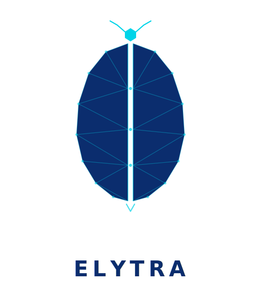
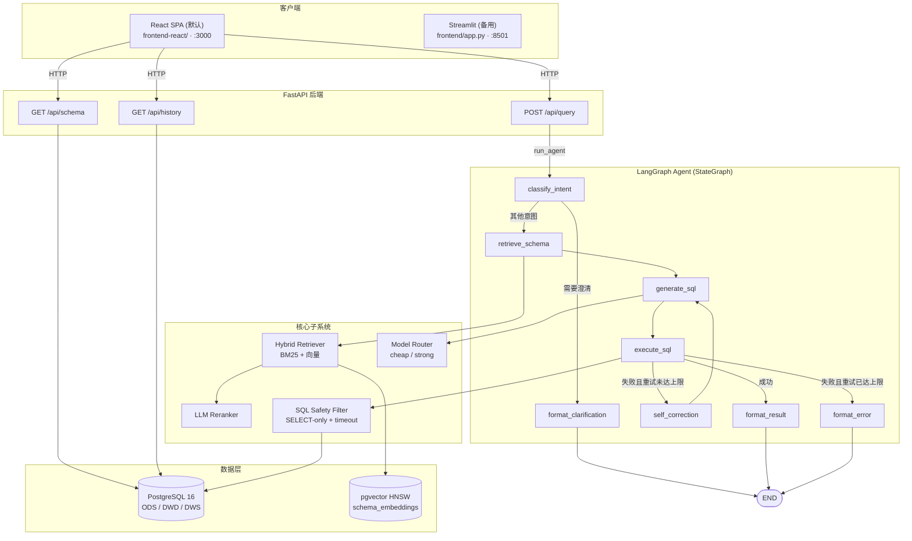

<div align="center">



# Elytra

**基于 LLM 的智能数据分析系统 — 自然语言进，SQL + 可视化出**

[](https://github.com/shuheng-mo/Elytra/actions/workflows/ci.yml)
[](LICENSE)
[](https://www.python.org/)
[](https://fastapi.tiangolo.com/)
[](https://github.com/langchain-ai/langgraph)
[](https://github.com/pgvector/pgvector)
[](#测试)
[](CONTRIBUTING.md)

[简体中文](README.md) | [English](README_EN.md)

</div>

---

## 目录

- [项目简介](#项目简介)
- [核心特性](#核心特性)
- [系统架构](#系统架构)
- [支持的数据源](#支持的数据源)
- [技术栈](#技术栈)
- [快速开始](#快速开始)
- [项目结构](#项目结构)
- [配置说明](#配置说明)
- [API 文档](#api-文档)
- [评估体系](#评估体系)
- [测试](#测试)
- [Roadmap](#roadmap)
- [架构决策](#架构决策)
- [贡献](#贡献)
- [License](#license)

---

## 项目简介

Elytra 是一个面向业务分析师的 **NL→SQL 智能数据分析系统**。用户用自然语言提问，系统自动：

1. **意图分类** — 判断是简单查询、聚合、多表关联、探索分析还是需要追问澄清
2. **Schema 召回** — BM25 + 向量混合检索 + LLM Reranker，从数据字典里挑出最相关的表
3. **SQL 生成** — 按意图选 few-shot 模板，路由到便宜或强大模型
4. **安全执行** — SELECT-only 过滤、`statement_timeout`、行数上限
5. **自修正** — 出错时把 SQL + 错误信息回喂给 LLM，最多 3 次重试
6. **结果格式化** — 根据结果形状自动推断 number/bar_chart/line_chart/table 可视化

> **它不是一个简单的 NL2SQL wrapper。** Elytra 自带完整的 ODS→DWD→DWS 三层数仓底座、Schema 智能检索、Agent 多步推理 + 自修正循环、多模型路由（成本/质量权衡），以及量化评估体系。

业务场景为模拟电商 SaaS 平台：用户、商品、订单、支付、行为日志五张原始表，加上一个订单明细宽表、一个用户画像表、一个商品维度表，再叠加 daily / weekly 的预聚合表。

---

## 核心特性

| 能力 | 实现 |
|:---|:---|
| **三层数仓** | ODS（5 表） → DWD（3 表宽表/画像/维度） → DWS（3 表预聚合） |
| **混合检索** | BM25（自定义 CJK + Latin tokenizer）+ pgvector HNSW 余弦检索 + min-max 归一化 + 加权融合（0.4 / 0.6） |
| **三种 Embedding 后端** | OpenAI 直连 / OpenRouter（支持 `openai/text-embedding-3-large`）/ 本地 `sentence-transformers`（BGE 系列） |
| **LLM Reranker** | Phase 1 用便宜 LLM 打分重排，失败时降级到上游顺序 |
| **LangGraph Agent** | 8 个节点的状态机，含意图路由、自修正回环（最多 3 次重试）、错误兜底 |
| **多模型路由** | 简单查询 → DeepSeek，多表 / 探索 / 连续失败 → Claude Sonnet |
| **SELECT-only 安全过滤** | 剥离注释和字符串字面量后扫描 16 个禁用关键字，多语句拒绝 |
| **OpenRouter 优先** | 一个 key 路由所有模型，自动 vendor 前缀；旧的 per-vendor key 仍向后兼容 |
| **可视化推断** | 按结果形状（行数 × 列数 + 列名）自动选 metric / bar / line / table |
| **量化评估** | 14 case 测试集，PASS/FAIL 阈值标注，per-category 细分，自修正成功率统计 |

---

## 系统架构

整体调用链：React 前端（Streamlit 备用）→ FastAPI → LangGraph Agent → 检索 / 路由 / 执行子系统 → PostgreSQL + pgvector。



---

## 支持的数据源

Elytra 通过可插拔的 **DataSource Connector** 抽象层支持多种数据库引擎。新增数据源
只需实现 `DataSourceConnector` 接口（约 100 行）并在 `config/datasources.yaml`
添加一段配置——无需改动 agent / 检索 / API 任何核心代码。

| 引擎 | 状态 | 用途 |
|:---|:---|:---|
| **PostgreSQL** | ✅ 内置 | 默认电商数仓（ODS / DWD / DWS 三层模型）|
| **DuckDB** | ✅ 内置 | 嵌入式 OLAP — 含 TPC-H 标准数据集与 Brazilian Olist 真实数据集 |
| **StarRocks** | ✅ 可选 | 高性能 OLAP，MySQL 协议兼容，独立 docker compose |

详细的连接器接口在 `src/connectors/base.py::DataSourceConnector`，每个 connector
都通过 `config/datasources.yaml` 中的一个 YAML 块描述：

```yaml
default_source: ecommerce_pg

datasources:
  - name: ecommerce_pg
    dialect: postgresql
    description: "电商模拟数仓"
    connection:
      host: ${DB_HOST:-localhost}
      port: ${DB_PORT:-5432}
      database: Elytra
    overlay: db/data_dictionary.yaml      # 中文字段描述（可选）

  - name: tpch_duckdb
    dialect: duckdb
    description: "TPC-H 标准测试数据集"
    connection:
      database_path: ./datasets/tpch/tpch.duckdb
    overlay: config/overlays/tpch_duckdb.yaml
```

API 调用时通过 `source` 字段指定数据源（省略则用 `default_source`）：

```bash
curl -X POST localhost:8000/api/query -d '{
  "query": "上个月销售额最高的品类",
  "source": "tpch_duckdb"
}'
```

`GET /api/datasources` 列出全部已配置数据源及其连接状态。

### 快速体验：TPC-H

```bash
python datasets/tpch/load_tpch.py                    # 生成 SF=0.1 DuckDB（无需下载）
python -m src.retrieval.bootstrap --source tpch_duckdb
# 然后用 source=tpch_duckdb 提问
```

### 快速体验：Brazilian E-Commerce

```bash
# 1) 从 Kaggle 下载 https://www.kaggle.com/datasets/olistbr/brazilian-ecommerce
#    解压到 datasets/brazilian_ecommerce/csv/
python datasets/brazilian_ecommerce/load_brazilian.py
python -m src.retrieval.bootstrap --source brazilian_ecommerce
```

### 启用 StarRocks（可选）

```bash
docker compose -f docker/starrocks/docker-compose.starrocks.yml up -d
# 详见 docker/starrocks/README.md
```

---

## 技术栈

| 层 | 技术 |
|:---|:---|
| 语言 | Python ≥ 3.11 |
| 数据库 | PostgreSQL 16 + [pgvector](https://github.com/pgvector/pgvector) / DuckDB / StarRocks（可选） |
| LLM 框架 | [LangChain](https://github.com/langchain-ai/langchain) + [LangGraph](https://github.com/langchain-ai/langgraph) |
| 后端 | [FastAPI](https://fastapi.tiangolo.com/) + [Uvicorn](https://www.uvicorn.org/) + [Pydantic v2](https://docs.pydantic.dev/latest/) |
| 前端（默认） | [React 18](https://react.dev/) + [Vite](https://vitejs.dev/) + [Tailwind CSS](https://tailwindcss.com/) + [shadcn/ui](https://ui.shadcn.com/) + [echarts-for-react](https://github.com/hustcc/echarts-for-react) |
| 前端（备用） | [Streamlit](https://streamlit.io/) ≥ 1.35（docker compose `--profile fallback`） |
| BM25 | [rank-bm25](https://github.com/dorianbrown/rank_bm25) |
| Embedding | OpenAI / OpenRouter / [sentence-transformers](https://www.sbert.net/) |
| 数据库驱动 | psycopg2-binary / asyncpg / duckdb / aiomysql |
| 容器化 | Docker + Docker Compose |
| 包管理 | [uv](https://github.com/astral-sh/uv)（推荐） |
| 测试 | pytest + httpx TestClient |

---

## 快速开始

### 前置要求

- Python ≥ 3.11
- Docker + Docker Compose（推荐方式）
- 一个 LLM API key — 推荐 [OpenRouter](https://openrouter.ai/)（一个 key 路由所有模型）

### 方式 1：Docker Compose（推荐）

```bash
# 1. 克隆仓库
git clone https://github.com/shuheng-mo/Elytra.git
cd Elytra

# 2. 配置环境变量
cp .env.example .env
# 用编辑器打开 .env，填入 OPENROUTER_API_KEY

# 3. 启动整个栈（首次会拉 pgvector/pg16 + 构建 backend/frontend-react 镜像）
docker compose up --build -d

# 4. 等 db 健康后，初始化 schema_embeddings 向量索引（一次性）
docker compose exec backend python -m src.retrieval.bootstrap

# 5. 跑端到端评估
docker compose exec backend python eval/run_eval.py
```

服务地址：

- **前端 UI（React，默认）**：<http://localhost:3000>
- **API Swagger**：<http://localhost:8000/docs>
- **健康检查**：<http://localhost:8000/healthz>

> **备用前端（Streamlit）**：用于前后端联调和图表渲染对拍。用 `docker compose --profile fallback up` 即可同时拉起 React(3000) 和 Streamlit(8501)。默认 `docker compose up` 只启 React。

### 方式 2：本地开发

```bash
# 1. 装依赖（uv 推荐）。--extra local-embed 会拉 sentence-transformers + torch
#    （arm64 ~700MB），用于本地 BGE embedding —— 这是 .env.example 里的默认。
#    如果你打算改用 OpenAI 直连 embedding，可以省掉这个 extra。
uv sync --extra local-embed

# 2. 起一个 pgvector 数据库（compose 也行）
docker run -d --name elytra-db \
  -e POSTGRES_DB=Elytra -e POSTGRES_USER=Elytra -e POSTGRES_PASSWORD=Elytra_dev \
  -p 5432:5432 \
  -v "$PWD/db/init.sql:/docker-entrypoint-initdb.d/01-init.sql:ro" \
  -v "$PWD/db/seed_data.sql:/docker-entrypoint-initdb.d/02-seed.sql:ro" \
  pgvector/pgvector:pg16

# 3. 配 .env，把 DATABASE_URL 和 DB_HOST 里的 `db` 改成 `localhost`
#    （`db` 只在 docker compose 内部网络解析得了）
cp .env.example .env

# 4. 初始化 schema_embeddings（首次会下载 ~100MB BGE 模型权重，离线后永久可用）
.venv/bin/python -m src.retrieval.bootstrap

# 5. 起后端
.venv/bin/uvicorn src.main:app --reload --port 8000

# 6. 起前端 — 任选一个：

# 6a. React 前端（默认、工业质感、推荐）
cd frontend-react && npm install && npm run dev
# → http://localhost:5173  (Vite dev server，自动反代 /api /ws 到 8000)

# 6b. Streamlit 前端（备用，用于前后端联调对拍）
.venv/bin/streamlit run frontend/app.py
# → http://localhost:8501
```

### 试一下

打开 <http://localhost:5173>（React，本地开发）或 <http://localhost:3000>（React，Docker）或 <http://localhost:8501>（Streamlit 备用），侧边栏点 "Schema" 浏览三层表结构，然后试试这些示例问题：

- 总共有多少注册用户
- 上个月销售额最高的商品品类是什么
- 最近 7 天每天的订单数量趋势
- 金牌用户最喜欢哪个品牌的商品
- 哪个城市的客单价最高

---

## 项目结构

```text
Elytra/
├── docker-compose.yml     # db + backend + frontend-react（默认），--profile fallback 可加 Streamlit
├── Dockerfile             # 后端镜像
├── pyproject.toml         # uv / pip 依赖 + ruff 配置
├── .env.example           # API key + 模型 + 检索权重模板
│
├── frontend-react/        # React SPA 默认前端（Vite + Tailwind + shadcn + ECharts）
├── frontend/              # Streamlit 备用前端（前后端联调对拍）
│
├── config/                # datasources.yaml（多源注册）+ permissions.yaml + overlays/（schema 富化）
├── db/                    # init.sql + seed_data.sql + migrations/ + data_dictionary.yaml
├── datasets/              # TPC-H + Brazilian E-Commerce 数据集加载脚本
├── docker/                # 可选 StarRocks docker compose
│
├── src/
│   ├── config.py          # 全局配置（环境变量读取）
│   ├── main.py            # FastAPI 入口（含 connector lifespan）
│   ├── models/            # Pydantic 请求/响应 + AgentState + Task 模型
│   ├── connectors/        # 可插拔数据源层（PG / DuckDB / StarRocks）+ factory / registry / overlay
│   ├── db/                # psycopg2 基础设施连接（仅元数据 DB）
│   ├── retrieval/         # BM25 + pgvector 混合检索 + reranker + embedder + 多源 bootstrap
│   ├── auth/              # YAML 驱动的角色权限过滤器
│   ├── tasks/             # 内存异步任务管理器（Semaphore 并发控制）
│   ├── chart/             # 结果形状 → ECharts 图表推断
│   ├── observability/     # 错误分类 + 输入 sanitizer（5 条规则）
│   ├── evolution/         # experience_pool + query_feedback 读写（自我进化）
│   ├── agent/             # LangGraph 状态机（13 节点）+ nodes/ + prompts/ + llm / cost
│   ├── router/            # cheap / strong 模型路由
│   └── api/               # REST + WebSocket 路由（query / replay / audit / feedback / evolution / ws …）
│
├── eval/                  # 测试集 + 评估 runner + 报告输出
├── tests/                 # 单测（207 passing，约 8 秒跑完）
├── assets/                # 项目 logo
└── README.md
```

---

## 配置说明

所有配置都通过环境变量读取（`.env` 自动加载）。完整列表见 [.env.example](.env.example)。

### LLM Provider

云端与本地后端可同时配置，路由优先级：**模型名前缀 `ollama/*` 或 `vllm/*`（若对应 base URL 已设）> OpenRouter > per-vendor fallback**。

| 变量 | 说明 |
|:---|:---|
| `OPENROUTER_API_KEY` | **推荐（云端默认）**。一个 key 路由所有 **chat** 模型，模型名要 `vendor/model` 格式 |
| `OPENAI_API_KEY` / `DEEPSEEK_API_KEY` / `ANTHROPIC_API_KEY` | 旧式 per-vendor key，仅当 OpenRouter key 为空时使用 |
| `OLLAMA_BASE_URL` | 本地 [Ollama](https://ollama.com)（≥ 0.2）服务地址，例 `http://localhost:11434`。触发条件：模型名以 `ollama/*` 开头 |
| `VLLM_BASE_URL` | 自托管 [vLLM](https://github.com/vllm-project/vllm) OpenAI-compatible server 地址，例 `http://localhost:8000`。触发条件：模型名以 `vllm/*` 开头 |

> ⚠️ **OpenRouter 不代理 `/v1/embeddings` 端点**，只能路由 chat completions。
> 因此 schema embedding 必须走"本地 sentence-transformers"、"OpenAI 直连"、
> "Ollama 本地" 或 "vLLM 自托管" 四条路之一 —— 详见下方 [Embedding](#embedding两种实际可用的后端) 一节。

**本地/自托管后端使用示例**：

```bash
# Ollama：先 ollama pull 模型
ollama pull qwen2.5:7b
ollama pull nomic-embed-text
# 在 .env 里
OLLAMA_BASE_URL=http://localhost:11434
DEFAULT_CHEAP_MODEL=ollama/qwen2.5:7b
EMBEDDING_MODEL=ollama/nomic-embed-text

# vLLM：先启动 OpenAI-compatible server
python -m vllm.entrypoints.openai.api_server --model meta-llama/Llama-3.1-70B-Instruct
# 在 .env 里
VLLM_BASE_URL=http://localhost:8000
DEFAULT_STRONG_MODEL=vllm/meta-llama/Llama-3.1-70B-Instruct
```

### 模型

| 变量 | 默认 | 说明 |
|:---|:---|:---|
| `DEFAULT_CHEAP_MODEL` | `deepseek/deepseek-chat` | 简单查询 / 一般聚合 |
| `DEFAULT_STRONG_MODEL` | `anthropic/claude-sonnet-4` | 多表 / 探索 / 连续失败重试 |

### Embedding（四种实际可用的后端）

| 变量 | 行为 |
|:---|:---|
| `EMBEDDING_MODEL=BAAI/bge-small-zh-v1.5` | **默认**。本地 sentence-transformers，512 维，~100MB，无需 API key、无需网络。中文场景召回质量好。需先 `uv sync --extra local-embed` |
| `EMBEDDING_MODEL=text-embedding-3-small` | OpenAI 直连，1536 维。需要单独的 `OPENAI_API_KEY`（OpenRouter key **不行**） |
| `EMBEDDING_MODEL=ollama/nomic-embed-text` | Ollama 本地，768 维。需 `OLLAMA_BASE_URL` + `ollama pull nomic-embed-text`。完全离线 |
| `EMBEDDING_MODEL=vllm/<model_id>` | vLLM 自托管。需 `VLLM_BASE_URL` 指向 `--model <model_id>` 启动的 vLLM 实例 |
| `EMBEDDING_PROVIDER` | `auto` (默认) / `openai` / `local` / `ollama` / `vllm` |
| `EMBEDDING_DIM` | 默认 0 = 自动从已知模型查表，不匹配的模型需手动指定 |

> ⚠️ **不要用 `text-embedding-3-large`（3072 维）**：pgvector 的 HNSW 索引有
> 2000 维硬上限，bootstrap 会在 `CREATE INDEX` 处直接失败。
>
> ⚠️ **不要把 `EMBEDDING_MODEL` 设成 `openai/...` 这种带 vendor 前缀的形式**
> 期望走 OpenRouter ——OpenRouter 不支持 `/v1/embeddings`，请求会无限挂到超时。
> 想用 OpenAI 模型就配 `OPENAI_API_KEY` 走直连。

> **切换 embedding 模型后必须重跑 bootstrap**：pgvector 列宽是固定维度的，
> 从 512 维换 1536 维需要 DROP + CREATE。运行 `python -m src.retrieval.bootstrap` 即可。

### 检索 / 自修正

| 变量 | 默认 | 说明 |
|:---|:---|:---|
| `BM25_WEIGHT` | `0.4` | 混合检索 BM25 权重 |
| `VECTOR_WEIGHT` | `0.6` | 混合检索向量权重 |
| `RERANK_TOP_K` | `5` | Reranker 输出的表数量 |
| `MAX_RETRY_COUNT` | `3` | 自修正最大重试次数 |
| `SQL_TIMEOUT_SECONDS` | `30` | 单条 SQL 的 `statement_timeout` |

### 数据源

| 变量 | 默认 | 说明 |
|:---|:---|:---|
| `DEFAULT_SOURCE` | _(空 → 读 YAML)_ | 覆盖 YAML 中的 `default_source`，值必须匹配 `config/datasources.yaml` 中的 `name:` |

`config/datasources.yaml` 自身支持 `${VAR:-default}` 占位符，环境相关的覆盖
建议放在 `.env`：

| 变量 | 用于 | 默认 |
|:---|:---|:---|
| `DB_HOST` / `DB_PORT` / `DB_NAME` / `DB_USER` / `DB_PASSWORD` | `ecommerce_pg` 连接块 | `localhost` / `5432` / `Elytra` / `Elytra` / `Elytra_dev` |
| `STARROCKS_HOST` / `STARROCKS_PORT` / `STARROCKS_DB` / `STARROCKS_USER` / `STARROCKS_PASSWORD` | `ecommerce_starrocks` 连接块 | `localhost` / `9030` / `elytra` / `root` / `(空)` |

---

## API 文档

### `POST /api/query`

请求：

```json
{
  "query": "上个月销售额最高的商品品类是什么",
  "session_id": "optional-session-id",
  "source": "ecommerce_pg",
  "user_id": "demo_analyst"
}
```

`source` 可省略，省略时使用 `config/datasources.yaml` 中的 `default_source`。
`user_id` 可省略，省略时使用 `config/permissions.yaml` 中的 `default_role`。
SQL 方言会从 source 背后的 connector 自动派生，旧的 `dialect` 字段保留兼容
但已被忽略。

响应：

```json
{
  "success": true,
  "query": "上个月销售额最高的商品品类是什么",
  "source": "ecommerce_pg",
  "dialect": "postgresql",
  "intent": "aggregation",
  "generated_sql": "SELECT category_l1, SUM(total_amount) AS total_sales FROM dwd_order_detail ...",
  "result": [
    {"category_l1": "电子产品", "total_sales": 1523400.00}
  ],
  "visualization_hint": "bar_chart",
  "final_answer": "查询执行成功，共返回 1 行结果。",
  "model_used": "deepseek/deepseek-chat",
  "retry_count": 0,
  "latency_ms": 1240,
  "token_count": 856,
  "error": null,
  "user_role": "analyst",
  "tables_filtered": 0,
  "chart_spec": {
    "chart_type": "bar",
    "title": "上个月销售额最高的商品品类是什么",
    "x_axis": {"field": "category_l1", "data": ["电子产品"]},
    "y_axis": {"field": "total_sales"},
    "series": [{"type": "bar", "data": [1523400.00]}]
  }
}
```

### `POST /api/query/async`

异步提交查询，立即返回 `task_id`，通过轮询或 WebSocket 获取进度和结果。

请求体与 `POST /api/query` 相同。响应：

```json
{
  "task_id": "a3f7b2c1",
  "status": "pending",
  "ws_url": "ws://localhost:8000/ws/task/a3f7b2c1"
}
```

### `GET /api/task/{task_id}`

轮询异步任务状态（WebSocket 不可用时的降级方案）：

```json
{
  "task_id": "a3f7b2c1",
  "status": "running",
  "current_step": "generating_sql",
  "progress_pct": 60
}
```

### `WebSocket /ws/task/{task_id}`

连接后服务端推送 JSON 事件流：`{"type": "progress", "step": "generating_sql", "pct": 60}`，
任务完成时推送 `{"type": "complete", "status": "success"}` 后关闭连接。

### `POST /api/replay/{history_id}`

从审计日志中取出历史查询，重新执行并对比结果 hash。用于验证模型升级后结果一致性。

### `GET /api/audit/stats?days=7`

返回最近 N 天的查询审计统计（总数、成功率、平均延迟、按模型/意图/数据源/用户分布）。

### `GET /api/datasources`

列出所有已注册的数据源连接器：

```json
{
  "datasources": [
    {
      "name": "ecommerce_pg",
      "dialect": "postgresql",
      "description": "电商模拟数仓 (ODS / DWD / DWS)",
      "connected": true,
      "table_count": 13,
      "is_default": true
    },
    {
      "name": "tpch_duckdb",
      "dialect": "duckdb",
      "description": "TPC-H 标准测试数据集",
      "connected": true,
      "table_count": 8,
      "is_default": false
    }
  ],
  "default": "ecommerce_pg"
}
```

`connected: false` 表示该数据源在启动时无法 ping 通——其余数据源仍然可用。

### `GET /api/schema?source=<name>`

返回单个数据源的 schema，按数仓层（`ODS` / `DWD` / `DWS`，没有层级前缀的进入
`OTHER` 桶）分组。`?source=` 显式指定数据源，省略时使用默认。SYSTEM 层不暴露。

### `GET /api/history?session_id=xxx&limit=20`

按 `session_id` 过滤、按 `created_at desc` 排序的历史查询记录。`limit` 范围 `1..200`。

完整 OpenAPI Schema 见 <http://localhost:8000/docs>。

---

## 评估体系

测试集放在 [`eval/test_queries.yaml`](eval/test_queries.yaml)（17 case 覆盖 5 个类别 + 跨源验证），评估脚本：

```bash
python eval/run_eval.py
# 或者指定参数
python eval/run_eval.py --api-url http://localhost:8000 --filter aggregation
```

输出会落到 `eval/results/<timestamp>.{json,md}`，markdown 报告含每个指标的 PASS/FAIL 标注、按类别细分、逐 case 详情。

### 验证结果（2026-04-06）

| 指标 | 实际值 | 目标 | 状态 |
|:---|---:|---:|:---:|
| SQL 执行成功率 | 92.9 % | ≥ 85 % | ✅ PASS |
| 结果准确率 | 92.9 % | ≥ 75 % | ✅ PASS |
| Schema 召回率 | 92.9 % | ≥ 80 % | ✅ PASS |
| 平均延迟 | 204 ms | < 5 000 ms | ✅ PASS |
| 自修正成功率 | 50 % (2 retried) | informational | — |

---

## 测试

```bash
# 全部测试
.venv/bin/python -m pytest tests/

# 详细模式
.venv/bin/python -m pytest tests/ -v

# 单个文件
.venv/bin/python -m pytest tests/test_agent.py -v
```

当前 **207 / 207 passing**，约 8 秒跑完。覆盖：

- `test_connectors.py`（32 cases）— SQL 安全过滤、数据契约、`ConnectorFactory` 懒加载、`ConnectorRegistry` 单例、overlay 兼容
- `test_retrieval.py`（20 cases）— tokenizer、BM25、min-max 归一化、HybridRetriever 分数融合、向量降级
- `test_agent.py`（43 cases）— SQL 安全过滤、模型路由全分支（含 intent-first 路由）、10 节点行为、graph 端到端（成功 / 重试 / 耗尽 / 澄清）、heuristic 意图分类器
- `test_api.py`（16 cases）— `/healthz`、`/api/query`、`/api/datasources`、`/api/schema`、`/api/history`
- `test_audit.py`（12 cases）— `_compute_result_hash` 确定性、回放端点、审计统计
- `test_permissions.py`（17 cases）— 角色解析、表/列过滤、LIMIT 注入/钳制、通配符匹配
- `test_tasks.py`（10 cases）— TaskManager 生命周期、并发控制、事件订阅、异步端点
- `test_chart.py`（25 cases）— 图表类型推断（6 种）、ECharts spec 构建、chart_generator 节点
- `test_sanitizer.py`（32 cases）— 越狱短语检测、角色反转、SQL 关键词密度、长度上限、合法查询放行

测试不依赖真实 DB 或 LLM — 通过 stub connector + 内存 registry 完成，本地可秒过。

---

## Roadmap

已完成（v0.2.0）：

- [x] **多数据源抽象层** — `DataSourceConnector` async ABC，PG / DuckDB / StarRocks 三引擎，YAML 驱动配置
- [x] **TPC-H 与 Brazilian E-Commerce 数据集** — DuckDB 内置 dbgen + Kaggle CSV 加载脚本
- [x] **方言自适应 SQL 生成** — `DIALECT_INSTRUCTIONS` 按目标引擎切换语法规则
- [x] **asyncpg 连接池** — agent 热路径全链路 async

已完成（v0.3.0）：

- [x] **异步任务架构** — `POST /api/query/async` + WebSocket 实时进度推送 + `GET /api/task/{id}` 轮询降级
- [x] **权限与多租户隔离** — YAML 配置驱动角色（analyst/operator/admin），表级通配符过滤 + 字段屏蔽 + 行数限制
- [x] **SQL 审计日志与回放** — `query_history` 扩展 9 列审计字段，`POST /api/replay/{id}` 结果一致性验证，`GET /api/audit/stats` 统计面板
- [x] **NL2Chart 自然语言生成图表** — 规则引擎推断 6 种图表类型（number_card / line / bar / pie / scatter / multi_line），输出 ECharts 兼容 JSON，Streamlit 前端自动渲染

已完成（v0.4.0）：

- [x] **React SPA 默认前端** — Vite + React 18 + Tailwind + shadcn/ui，覆盖 Query / Schema / History / Audit / Data Connectors / Settings 六个页面；Streamlit 保留为 docker compose `--profile fallback` 备用前端
- [x] **实时 Agent 时间线** — 基于 `astream_events(v2)` 的 WebSocket 进度推送，每个 step 可点开查看 agent 内部"思考"日志（Claude-style）
- [x] **运行时连接器管理** — `POST /api/datasources` 表单接入新数据源 + `DELETE` 删除，写入 `config/datasources.local.yaml` 用户层（git 忽略）；主层 YAML 全程不动
- [x] **Token 成本追踪** — 新增 `src/agent/cost.py` 混合费率表，每次查询写入 `query_history.estimated_cost`；同时修复了异步任务从未持久化历史的 bug（`task_manager` 解耦了 `persist_fn`）
- [x] **多格式导出** — Schema / History / Audit 三个页面都支持 Excel + CSV 导出；Settings 提供 session 级别的多 sheet xlsx 一次性打包

已完成（v0.5.0）：

- [x] **多轮对话（完整形式）** — `resolve_context` + `summarize_conversation` 两个 LangGraph 节点；`query_history.session_id` 作为单一真理源；`conversation_summary` 表在 turn 数 ≥ 3 后自动写入 LLM 压缩摘要；React QueryPage 重构为 ChatGPT 式线性对话流 + "新对话"按钮 + 会话指示器
- [x] **本地 reranker + 列级检索** — `BAAI/bge-reranker-v2-m3` cross-encoder 加载，`make_reranker()` factory 按 `RERANKER_PROVIDER` 选 `auto/local/llm`（默认 `llm` 以保证低延迟，本地模型为显式可选）；`schema_embeddings` 同时索引表级 + 列级行（40/40 基线每源额外灌入 50-150 列），`HybridRetriever` 把列级命中以 0.6 系数合并回父表分数；顺带修复了 `LLMReranker` 旁路 OpenRouter 的老 bug
- [x] **可观测性最小闭环** — `src/observability/errors.py` 引入 `ErrorType` 枚举（7 类）+ `classify_error()` 接入 `self_correction` 节点；`query_history.error_type` 新列驱动 `top_errors` 聚合；`src/observability/sanitizer.py` 5 条规则（长度上限 / 越狱短语 / 角色反转 / SQL 关键词密度 / markdown 代码块）在 `run_agent_async` 入口处拦截恶意输入
- [x] **每日查询趋势** — `AuditStatsResponse.time_series` 按天聚合 total/successes，Python 侧补 0 天保证前端折线连贯；`AuditDashboard` 替换占位符为 ECharts `line`，同源加 3 个自我进化统计卡片
- [x] **Agent 自我进化** — `experience_pool` + `query_feedback` 两张 pgvector 表，`embedding` 列由 `Embedder.bootstrap_experience_tables()` 在启动时注入当前 dim（维度错配时自动 DROP+ADD）；`retrieve_experience` / `save_experience` 两个新节点按自修正成功路径条件激活；`POST /api/feedback` + `GET /api/evolution/stats` + React `FeedbackButtons` 组件组成 UI 闭环；`PromptContext` dataclass 统一 dynamic few-shot + conversation context 注入点

已完成（v0.6.0）：

- [x] **性能优化（5.7x 提速）** — 单例 Embedder + `local_files_only` + startup 预热消除冷启动瓶颈；heuristic 意图分类器替代 LLM 调用（-10s）；去掉 LLM rerank 默认路径（-12s）；OpenRouter 客户端连接复用；query embedding 跨节点缓存；intent-aware 动态 top-K；端到端延迟从 ~57s 降至 ~10s
- [x] **节点级性能埋点** — 每个 LangGraph 节点报告 `elapsed_ms`，写入 `AgentState.node_timings`，API 响应中返回 `node_timings` 字段
- [x] **Admin 运行时配置** — `GET/PUT /api/config` admin-only 端点，可在线修改模型名称、检索权重、重试次数等参数并热加载；React Settings 页面 admin 可见编辑器；API 密钥不暴露
- [x] **Feedback 按钮修复** — async 模式 `history_id` 写回 state + 前端 `agentStateToResponse` 补全字段映射
- [x] **权限 Badge 修复** — QueryPage 角色显示改为从 `useSettings()` 读取，不再硬编码 `analyst`

下一阶段主要特性（v0.7 → v1.0，定位 **Text-to-Analytics Pipeline** 赛道，围绕"验证 + 建模"双护城河建设）：

**v0.7.0 — Trustworthy SQL**（Verification Loop，幻觉 SQL 安全阀）

- [ ] **SQL AST 静态校验** — 引入 `sqlglot` 解析所有生成的 SQL，表/列对照 `retrieved_schemas` 白名单验证，拦截幻觉 identifier 与异常 JOIN 条件
- [ ] **EXPLAIN dry-run 层** — `DataSourceConnector` 增 `explain()` 抽象，各方言实现；对估计行数异常 / 空结果集 / 字段类型不匹配做执行前预拦截
- [ ] **结果 sanity check** — 聚合量级跨历史比对、分组数异常、NaN/Inf、空集检测；可疑结果标记 `verification_flagged` 但不阻断
- [ ] **多路径生成 + 多数投票** — 高复杂度查询并发 3 路径（不同 temperature 或模型），sqlglot 归一化后多数派胜出
- [ ] **benchmark 硬测试集** — 测试集从 17 case 扩到 50 + 10 个"已知错误 SQL"硬测试，A/B runner 对比 verification 前后拦截率

**v0.8.0 — Schema Intelligence Lite**（脏 schema 自动化）

- [ ] **列级 profiling cron** — 周级采样 distinct count / null% / sample values，写入 `column_profile` 表驱动 retriever 加权
- [ ] **FK/PK 自动发现** — 基于值重叠率（> 0.9）+ 命名启发式（`*_id`）+ 类型匹配推断跨表关系
- [ ] **Schema drift 检测** — 每次 introspection 对比 diff，新增/删除/类型变化写审计日志，24h 内 alert
- [ ] **Auto-overlay 生成** — LLM 自动 propose 字段中文名 + 业务描述，写入 `config/overlays/<source>.auto.yaml`；人工 overlay 永远胜出

**v0.9.0 — Semantic Layer + Public Benchmark**（对外叙事的数字核心）

- [ ] **指标 proposer + review UI** — 基于 query_history + profiling 推荐业务指标定义（"活跃用户"、"GMV" 等），前端 `SemanticReviewPage` 支持 human-in-the-loop 审核
- [ ] **Spider 2.0 enterprise 子集跑分** — BigQuery + Snowflake vertical 各 30 case，目标 pass rate ≥ 35%
- [ ] **自家中文企业 schema benchmark v1** — 100 case 覆盖 ODS/DWD/DWS 多层数仓 + 多方言，目标 accuracy ≥ 75%
- [ ] **公开 leaderboard 页** — 对比 v0.5 → v0.9 在 4 个 benchmark 上的趋势

**v1.0.0 — Polish & Public Launch**（GA + 分发）

- [ ] **英文 README + 3 分钟 Docker Compose quickstart** — 降低 github onboarding 阻力
- [ ] **技术白皮书 + blog post + demo video** — Verification + Schema Intelligence 完整技术叙事，可投 workshop
- [ ] **公开 GA release** — Show HN / r/dataengineering / a16z newsletter
- [ ] **3 个 real-world case study** — 与种子用户协作撰写

**已落地**（v0.6.x 基础设施补丁，不占用 hero feature 时间预算）：

- [x] **私有化 LLM 部署（Ollama / vLLM）** — chat + embedding 均支持 `ollama/*` 和 `vllm/*` 前缀路由
- [x] **GitHub Actions CI** — ruff lint + pytest 全量回归，见 `.github/workflows/ci.yml`

**v1.1+ 候选池**（由 GA 后社区反馈排序，不预先承诺）：跨源联邦查询（DuckDB 联邦层）、dbt package 集成、VSCode 扩展、企业 IAM（LDAP/SSO/Ranger）、Multi-Hop decompose、Tool-use function-calling agent、行级安全 + 数据脱敏、K8s helm chart

---

## 常见问题

### 为什么不用 Celery / Redis 做异步任务？

Elytra 的吞吐瓶颈在 LLM API 的请求速率限制，而非 CPU 或 I/O。单进程 asyncio 任务管理器配合 Semaphore 并发控制即可处理约 50 个并发查询，远超典型 BI 工具的使用模式。引入 Celery 会增加运维复杂度（broker 部署、worker 管理、结果后端），但不会带来有意义的吞吐提升。

如果需要水平扩展，正确做法是：

1. 多 API Key 轮换以突破单 key 速率限制
2. 请求队列按优先级排序（交互查询 > 批量评测）
3. 在结果层面缓存高频查询

当瓶颈在外部 API 调用而非本地计算时，传统的服务分片方案收益为零。

### 权限模型为什么用 YAML 配置而非完整 RBAC？

企业数据平台需要权限管控，但 Elytra 作为分析工具（非平台基础设施），不需要实现完整的 RBAC 系统。YAML 驱动的角色配置具有以下优势：

- **零外部依赖** — 不需要额外的权限数据库或 SSO 集成
- **配置即代码** — 权限变更可纳入 Git 版本控制和代码审查
- **渐进式升级** — 当需要对接 LDAP/SSO 时，只需替换 `PermissionFilter.get_context()` 的实现，接口不变

当前实现支持：表级通配符过滤（`dws_*`）、字段级屏蔽（`denied_columns`）、角色级行数限制（`max_result_rows`）。

---

## 贡献

欢迎贡献！请先阅读 [CONTRIBUTING.md](CONTRIBUTING.md) 了解开发流程、代码规范和提交约定。

如果你发现了 bug 或有功能建议，欢迎提 [Issue](https://github.com/shuheng-mo/Elytra/issues)。

---

## License

[MIT](LICENSE) © shuheng-mo

---

<div align="center">


**[⬆ 返回顶部](#elytra)**

</div>
