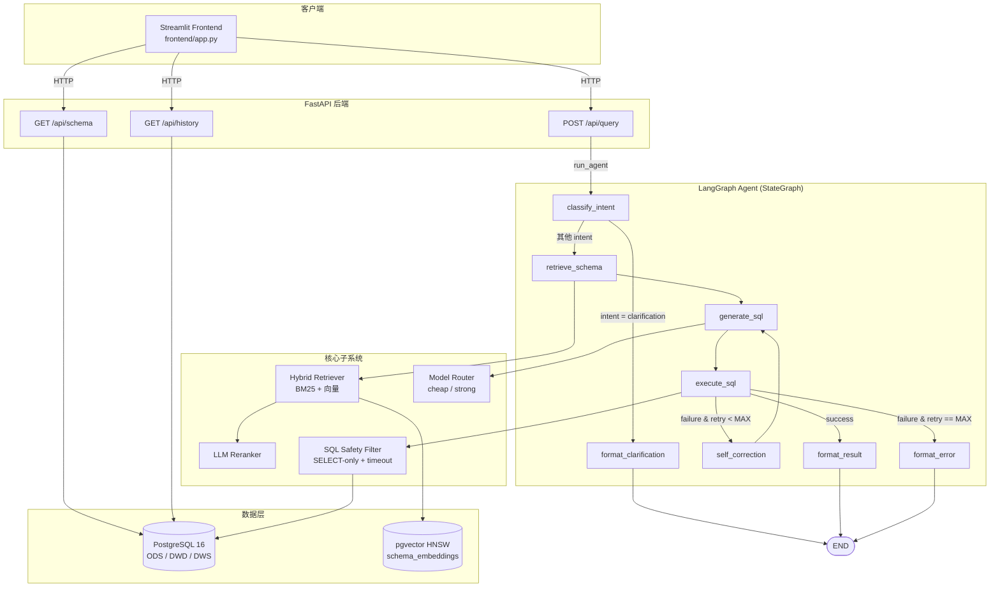

<div align="center">


# Elytra

**基于 LLM 的智能数据分析系统 — 自然语言进，SQL + 可视化出**

[](LICENSE)
[](https://www.python.org/)
[](https://fastapi.tiangolo.com/)
[](https://github.com/langchain-ai/langgraph)
[](https://github.com/pgvector/pgvector)
[](#测试)
[](CONTRIBUTING.md)

[简体中文](README.md) | [English](README_EN.md)

</div>

---

## 目录

- [项目简介](#项目简介)
- [核心特性](#核心特性)
- [系统架构](#系统架构)
- [技术栈](#技术栈)
- [快速开始](#快速开始)
- [项目结构](#项目结构)
- [配置说明](#配置说明)
- [API 文档](#api-文档)
- [评估体系](#评估体系)
- [测试](#测试)
- [Roadmap](#roadmap)
- [贡献](#贡献)
- [License](#license)

---

## 项目简介

Elytra 是一个面向业务分析师的 **NL→SQL 智能数据分析系统**。用户用自然语言提问，系统自动：

1. **意图分类** — 判断是简单查询、聚合、多表关联、探索分析还是需要追问澄清
2. **Schema 召回** — BM25 + 向量混合检索 + LLM Reranker，从数据字典里挑出最相关的表
3. **SQL 生成** — 按意图选 few-shot 模板，路由到便宜或强大模型
4. **安全执行** — SELECT-only 过滤、`statement_timeout`、行数上限
5. **自修正** — 出错时把 SQL + 错误信息回喂给 LLM，最多 3 次重试
6. **结果格式化** — 根据结果形状自动推断 number/bar_chart/line_chart/table 可视化

> **它不是一个简单的 NL2SQL wrapper。** Elytra 自带完整的 ODS→DWD→DWS 三层数仓底座、Schema 智能检索、Agent 多步推理 + 自修正循环、多模型路由（成本/质量权衡），以及量化评估体系。

业务场景为模拟电商 SaaS 平台：用户、商品、订单、支付、行为日志五张原始表，加上一个订单明细宽表、一个用户画像表、一个商品维度表，再叠加 daily / weekly 的预聚合表。

---

## 核心特性

| 能力 | 实现 |
|:---|:---|
| **三层数仓** | ODS（5 表） → DWD（3 表宽表/画像/维度） → DWS（3 表预聚合） |
| **混合检索** | BM25（自定义 CJK + Latin tokenizer）+ pgvector HNSW 余弦检索 + min-max 归一化 + 加权融合（0.4 / 0.6） |
| **三种 Embedding 后端** | OpenAI 直连 / OpenRouter（支持 `openai/text-embedding-3-large`）/ 本地 `sentence-transformers`（BGE 系列） |
| **LLM Reranker** | Phase 1 用便宜 LLM 打分重排，失败时降级到上游顺序 |
| **LangGraph Agent** | 8 个节点的状态机，含意图路由、自修正回环（最多 3 次重试）、错误兜底 |
| **多模型路由** | 简单查询 → DeepSeek，多表 / 探索 / 连续失败 → Claude Sonnet |
| **SELECT-only 安全过滤** | 剥离注释和字符串字面量后扫描 16 个禁用关键字，多语句拒绝 |
| **OpenRouter 优先** | 一个 key 路由所有模型，自动 vendor 前缀；旧的 per-vendor key 仍向后兼容 |
| **可视化推断** | 按结果形状（行数 × 列数 + 列名）自动选 metric / bar / line / table |
| **量化评估** | 14 case 测试集，PASS/FAIL 阈值标注，per-category 细分，自修正成功率统计 |

---

## 系统架构

整体调用链：Streamlit 前端 → FastAPI → LangGraph Agent → 检索 / 路由 / 执行子系统 → PostgreSQL + pgvector。



---

## 技术栈

| 层 | 技术 |
|:---|:---|
| 语言 | Python ≥ 3.11 |
| 数据库 | PostgreSQL 16 + [pgvector](https://github.com/pgvector/pgvector) |
| LLM 框架 | [LangChain](https://github.com/langchain-ai/langchain) + [LangGraph](https://github.com/langchain-ai/langgraph) |
| 后端 | [FastAPI](https://fastapi.tiangolo.com/) + [Uvicorn](https://www.uvicorn.org/) + [Pydantic v2](https://docs.pydantic.dev/latest/) |
| 前端 | [Streamlit](https://streamlit.io/) ≥ 1.35 |
| BM25 | [rank-bm25](https://github.com/dorianbrown/rank_bm25) |
| Embedding | OpenAI / OpenRouter / [sentence-transformers](https://www.sbert.net/) |
| 数据库驱动 | psycopg2-binary |
| 容器化 | Docker + Docker Compose |
| 包管理 | [uv](https://github.com/astral-sh/uv)（推荐） |
| 测试 | pytest + httpx TestClient |

---

## 快速开始

### 前置要求

- Python ≥ 3.11
- Docker + Docker Compose（推荐方式）
- 一个 LLM API key — 推荐 [OpenRouter](https://openrouter.ai/)（一个 key 路由所有模型）

### 方式 1：Docker Compose（推荐）

```bash
# 1. 克隆仓库
git clone https://github.com/shuheng-mo/Elytra.git
cd Elytra

# 2. 配置环境变量
cp .env.example .env
# 用编辑器打开 .env，填入 OPENROUTER_API_KEY

# 3. 启动整个栈（首次会拉 pgvector/pg16 + 构建 backend/frontend 两个镜像）
docker compose up --build -d

# 4. 等 db 健康后，初始化 schema_embeddings 向量索引（一次性）
docker compose exec backend python -m src.retrieval.bootstrap

# 5. 跑端到端评估
docker compose exec backend python eval/run_eval.py
```

服务地址：

- **前端 UI**：<http://localhost:8501>
- **API Swagger**：<http://localhost:8000/docs>
- **健康检查**：<http://localhost:8000/healthz>

### 方式 2：本地开发

```bash
# 1. 装依赖（uv 推荐）
uv sync

# 2. 起一个 pgvector 数据库（compose 也行）
docker run -d --name elytra-db \
  -e POSTGRES_DB=Elytra -e POSTGRES_USER=Elytra -e POSTGRES_PASSWORD=Elytra_dev \
  -p 5432:5432 \
  -v "$PWD/db/init.sql:/docker-entrypoint-initdb.d/01-init.sql:ro" \
  -v "$PWD/db/seed_data.sql:/docker-entrypoint-initdb.d/02-seed.sql:ro" \
  pgvector/pgvector:pg16

# 3. 配 .env，把 DATABASE_URL 改成 @localhost:5432
cp .env.example .env

# 4. 初始化 schema_embeddings
.venv/bin/python -m src.retrieval.bootstrap

# 5. 起后端
.venv/bin/uvicorn src.main:app --reload --port 8000

# 6. 在另一个终端起前端
.venv/bin/streamlit run frontend/app.py
```

### 试一下

打开 <http://localhost:8501>，点击侧边栏的"数据字典"浏览三层表结构，然后试试这些示例问题：

- 总共有多少注册用户
- 上个月销售额最高的商品品类是什么
- 最近 7 天每天的订单数量趋势
- 金牌用户最喜欢哪个品牌的商品
- 哪个城市的客单价最高

---

## 项目结构

```text
Elytra/
├── docker-compose.yml             # 三服务编排：db + backend + frontend
├── Dockerfile                     # 后端镜像
├── frontend/
│   ├── Dockerfile                 # 前端镜像
│   └── app.py                     # 单文件 Streamlit 应用
├── pyproject.toml                 # uv / pip 依赖 + ruff 配置
├── .env.example                   # API key + 模型 + 检索权重模板
│
├── db/
│   ├── init.sql                   # PG 初始化（11 张业务表 + 2 张系统表）
│   ├── seed_data.sql              # 模拟数据
│   └── data_dictionary.yaml       # 数据字典（中英双语）
│
├── src/
│   ├── config.py                  # 全局配置（环境变量读取）
│   ├── main.py                    # FastAPI 入口
│   │
│   ├── models/
│   │   ├── request.py             # QueryRequest
│   │   ├── response.py            # QueryResponse / SchemaResponse / HistoryResponse
│   │   └── state.py               # AgentState (LangGraph)
│   │
│   ├── db/
│   │   ├── connection.py          # psycopg2 上下文管理器
│   │   └── executor.py            # SELECT-only 安全过滤 + 超时
│   │
│   ├── retrieval/
│   │   ├── schema_loader.py       # YAML → TableInfo
│   │   ├── bm25_index.py          # CJK + Latin tokenizer + BM25Okapi
│   │   ├── embedder.py            # OpenAI / OpenRouter / 本地三后端
│   │   ├── hybrid_retriever.py    # BM25 + 向量混合
│   │   ├── reranker.py            # LLM-as-Reranker
│   │   └── bootstrap.py           # 一次性初始化 schema_embeddings
│   │
│   ├── agent/
│   │   ├── graph.py               # LangGraph 状态机
│   │   ├── llm.py                 # OpenRouter-first chat 调用
│   │   ├── nodes/                 # 6 个节点
│   │   └── prompts/               # intent / sql_generation / self_correction / reranking
│   │
│   ├── router/
│   │   └── model_router.py        # 规则引擎：cheap / strong 模型路由
│   │
│   └── api/
│       ├── query.py               # POST /api/query
│       ├── schema.py              # GET  /api/schema
│       └── history.py             # GET  /api/history
│
├── eval/
│   ├── test_queries.yaml          # 14 case 测试集
│   ├── run_eval.py                # 评估 runner
│   └── results/                   # 评估报告输出
│
├── tests/
│   ├── test_retrieval.py          # 20 case
│   ├── test_agent.py              # 41 case
│   └── test_api.py                # 14 case
│
├── assets/                        # 项目 logo
└── README.md
```

---

## 配置说明

所有配置都通过环境变量读取（`.env` 自动加载）。完整列表见 [.env.example](.env.example)。

### LLM Provider（二选一）

| 变量 | 说明 |
|:---|:---|
| `OPENROUTER_API_KEY` | **推荐**。一个 key 路由所有模型，模型名要 `vendor/model` 格式 |
| `OPENAI_API_KEY` / `DEEPSEEK_API_KEY` / `ANTHROPIC_API_KEY` | 旧式 per-vendor key，仅当 OpenRouter key 为空时使用 |

### 模型

| 变量 | 默认 | 说明 |
|:---|:---|:---|
| `DEFAULT_CHEAP_MODEL` | `deepseek/deepseek-chat` | 简单查询 / 一般聚合 |
| `DEFAULT_STRONG_MODEL` | `anthropic/claude-sonnet-4` | 多表 / 探索 / 连续失败重试 |

### Embedding（三种后端自动选择）

| 变量 | 行为 |
|:---|:---|
| `EMBEDDING_MODEL=openai/text-embedding-3-large` | 走 OpenRouter（如果只有 OpenAI key 也能直连） |
| `EMBEDDING_MODEL=text-embedding-3-small` | 走 OpenAI 直连 |
| `EMBEDDING_MODEL=BAAI/bge-small-zh-v1.5` | 走本地 sentence-transformers（需 `pip install -e ".[local-embed]"`） |
| `EMBEDDING_PROVIDER` | `auto` (默认) / `openai` / `openrouter` / `local` |
| `EMBEDDING_DIM` | 默认 0 = 自动从已知模型查表，不匹配的模型需手动指定 |

> **切换 embedding 模型后必须重跑 bootstrap**：pgvector 列宽是固定维度的，从 1536 维换 3072 维需要 DROP + CREATE。运行 `python -m src.retrieval.bootstrap` 即可。

### 检索 / 自修正

| 变量 | 默认 | 说明 |
|:---|:---|:---|
| `BM25_WEIGHT` | `0.4` | 混合检索 BM25 权重 |
| `VECTOR_WEIGHT` | `0.6` | 混合检索向量权重 |
| `RERANK_TOP_K` | `5` | Reranker 输出的表数量 |
| `MAX_RETRY_COUNT` | `3` | 自修正最大重试次数 |
| `SQL_TIMEOUT_SECONDS` | `30` | 单条 SQL 的 `statement_timeout` |

---

## API 文档

### `POST /api/query`

请求：

```json
{
  "query": "上个月销售额最高的商品品类是什么",
  "session_id": "optional-session-id",
  "dialect": "postgresql"
}
```

响应：

```json
{
  "success": true,
  "query": "上个月销售额最高的商品品类是什么",
  "intent": "aggregation",
  "generated_sql": "SELECT category_l1, SUM(total_amount) AS total_sales FROM dwd_order_detail ...",
  "result": [
    {"category_l1": "电子产品", "total_sales": 1523400.00}
  ],
  "visualization_hint": "bar_chart",
  "final_answer": "查询执行成功，共返回 1 行结果。",
  "model_used": "deepseek/deepseek-chat",
  "retry_count": 0,
  "latency_ms": 1240,
  "token_count": 856,
  "error": null
}
```

### `GET /api/schema`

返回按层级分组的数据字典（`ODS` / `DWD` / `DWS`），SYSTEM 层不暴露。

### `GET /api/history?session_id=xxx&limit=20`

按 `session_id` 过滤、按 `created_at desc` 排序的历史查询记录。`limit` 范围 `1..200`。

完整 OpenAPI Schema 见 <http://localhost:8000/docs>。

---

## 评估体系

测试集放在 [`eval/test_queries.yaml`](eval/test_queries.yaml)（14 case 覆盖 5 个类别），评估脚本：

```bash
python eval/run_eval.py
# 或者指定参数
python eval/run_eval.py --api-url http://localhost:8000 --filter aggregation
```

输出会落到 `eval/results/<timestamp>.{json,md}`，markdown 报告含每个指标的 PASS/FAIL 标注、按类别细分、逐 case 详情。

### 验证结果（2026-04-06）

| 指标 | 实际值 | 目标 | 状态 |
|:---|---:|---:|:---:|
| SQL 执行成功率 | 92.9 % | ≥ 85 % | ✅ PASS |
| 结果准确率 | 92.9 % | ≥ 75 % | ✅ PASS |
| Schema 召回率 | 92.9 % | ≥ 80 % | ✅ PASS |
| 平均延迟 | 204 ms | < 5 000 ms | ✅ PASS |
| 自修正成功率 | 50 % (2 retried) | informational | — |

---

## 测试

```bash
# 全部测试
.venv/bin/python -m pytest tests/

# 详细模式
.venv/bin/python -m pytest tests/ -v

# 单个文件
.venv/bin/python -m pytest tests/test_agent.py -v
```

当前 **75 / 75 passing**，0.8 秒跑完。覆盖：

- `test_retrieval.py`（20 cases）— tokenizer、BM25、min-max 归一化、HybridRetriever 分数融合、向量降级、真实数据字典 smoke
- `test_agent.py`（41 cases）— SQL 安全过滤、模型路由全分支、节点行为、graph 端到端（成功 / 重试成功 / 重试耗尽 / 澄清短路）
- `test_api.py`（14 cases）— `/healthz`、`/api/query`（成功 / 失败 / 方言拒绝 / 空查询 / agent 异常 500）、`/api/schema`、`/api/history`

测试不依赖真实 DB 或 LLM — 全部通过 monkey-patching stub 完成，本地可秒过。

---

## Roadmap

下一阶段主要特性：

- [ ] **多轮对话** — `conversation_history` + 上下文摘要 + 指代消解
- [ ] **本地 reranker** — `bge-reranker-v2-m3` 替代 LLM-as-Reranker，加字段级检索
- [ ] **流式 SSE 端点** — `POST /api/query/stream`，前端展示 Agent 思考过程
- [ ] **HiveQL / SparkSQL 方言** — 切换 prompt 模板和语法校验
- [ ] **Tool-use Agent** — 升级为 function-calling 模式
- [ ] **可观测性** — 结构化 trace、token 成本追踪、错误分类、asyncpg 池

---

## 贡献

欢迎贡献！请先阅读 [CONTRIBUTING.md](CONTRIBUTING.md) 了解开发流程、代码规范和提交约定。

如果你发现了 bug 或有功能建议，欢迎提 [Issue](https://github.com/shuheng-mo/Elytra/issues)。

---

## License

[MIT](LICENSE) © shuheng-mo

---

<div align="center">


**[⬆ 返回顶部](#elytra)**

</div>
