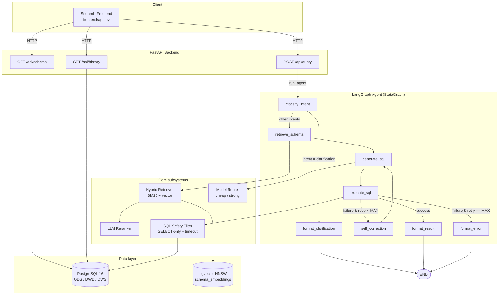

<div align="center">


# Elytra

**LLM-powered intelligent data analysis — natural language in, SQL + visualization out**

[](LICENSE)
[](https://www.python.org/)
[](https://fastapi.tiangolo.com/)
[](https://github.com/langchain-ai/langgraph)
[](https://github.com/pgvector/pgvector)
[](#testing)
[](CONTRIBUTING.md)

[English](README_EN.md) | [简体中文](README.md)

</div>

---

## Table of Contents

- [Overview](#overview)
- [Key Features](#key-features)
- [Architecture](#architecture)
- [Tech Stack](#tech-stack)
- [Getting Started](#getting-started)
- [Project Structure](#project-structure)
- [Configuration](#configuration)
- [API Reference](#api-reference)
- [Evaluation](#evaluation)
- [Testing](#testing)
- [Roadmap](#roadmap)
- [Contributing](#contributing)
- [License](#license)

---

## Overview

Elytra is an **NL→SQL intelligent analytics system** for business analysts.
You ask in plain language; the system:

1. **Classifies intent** — simple query, aggregation, multi-join, exploration, or clarification
2. **Retrieves schema** — BM25 + dense vector hybrid retrieval over a YAML data dictionary, then an LLM reranker
3. **Generates SQL** — intent-specific few-shot prompt, routed to a cheap or strong model
4. **Executes safely** — SELECT-only filter, `statement_timeout`, row cap
5. **Self-corrects** — feeds the failed SQL + error back to the LLM, up to 3 retries
6. **Formats results** — picks number / bar / line / table visualization from the result shape

> **It is not a thin NL2SQL wrapper.** Elytra ships a full ODS→DWD→DWS data warehouse, schema-aware retrieval, an Agent loop with self-correction, multi-model routing (cost vs. quality trade-off), and a quantitative evaluation harness.

The reference scenario is an e-commerce SaaS platform: 5 raw operational tables (users, products, orders, payments, behavior logs), 3 cleaned/joined wide tables (order detail, user profile, product dim), and 3 pre-aggregated DWS tables (daily sales, user activity, weekly product ranking).

---

## Key Features

| Capability | Implementation |
|:---|:---|
| **Three-layer warehouse** | ODS (5 tables) → DWD (3 wide / profile / dim) → DWS (3 pre-aggregations) |
| **Hybrid retrieval** | BM25 (custom CJK + Latin tokenizer) + pgvector HNSW cosine search + min-max normalization + weighted fusion (0.4 / 0.6) |
| **Three embedding backends** | OpenAI direct / OpenRouter (`openai/text-embedding-3-large` works) / local `sentence-transformers` (BGE family) |
| **LLM Reranker** | Phase 1 cheap-LLM JSON scoring with graceful upstream-order fallback |
| **LangGraph Agent** | 8-node state machine with intent routing, self-correction loop (up to 3 retries), error fallback |
| **Multi-model routing** | Simple → DeepSeek; multi-table / exploration / repeated failures → Claude Sonnet |
| **SELECT-only safety filter** | Strips comments + string literals before scanning 16 forbidden keywords; rejects multi-statement payloads |
| **OpenRouter-first** | One key routes every model; bare names auto-prefixed; legacy per-vendor keys still supported |
| **Visualization inference** | Dispatch on result shape (rows × cols + column names) → metric / bar / line / table |
| **Quantitative evaluation** | 14-case test set with PASS/FAIL annotations, per-category breakdown, self-correction success rate |

---

## Architecture

End-to-end call chain: Streamlit frontend → FastAPI → LangGraph agent →
retrieval / routing / execution subsystems → PostgreSQL + pgvector.



---

## Tech Stack

| Layer | Technology |
|:---|:---|
| Language | Python ≥ 3.11 |
| Database | PostgreSQL 16 + [pgvector](https://github.com/pgvector/pgvector) |
| LLM framework | [LangChain](https://github.com/langchain-ai/langchain) + [LangGraph](https://github.com/langchain-ai/langgraph) |
| Backend | [FastAPI](https://fastapi.tiangolo.com/) + [Uvicorn](https://www.uvicorn.org/) + [Pydantic v2](https://docs.pydantic.dev/latest/) |
| Frontend | [Streamlit](https://streamlit.io/) ≥ 1.35 |
| BM25 | [rank-bm25](https://github.com/dorianbrown/rank_bm25) |
| Embeddings | OpenAI / OpenRouter / [sentence-transformers](https://www.sbert.net/) |
| DB driver | psycopg2-binary |
| Containers | Docker + Docker Compose |
| Package manager | [uv](https://github.com/astral-sh/uv) (recommended) |
| Testing | pytest + httpx TestClient |

---

## Getting Started

### Prerequisites

- Python ≥ 3.11
- Docker + Docker Compose (recommended)
- One LLM API key — [OpenRouter](https://openrouter.ai/) recommended (one key for every model)

### Option 1: Docker Compose (recommended)

```bash
# 1. Clone
git clone https://github.com/shuheng-mo/Elytra.git
cd Elytra

# 2. Configure
cp .env.example .env
# Edit .env and fill in OPENROUTER_API_KEY

# 3. Bring up the stack (first run pulls pgvector/pg16 + builds backend & frontend)
docker compose up --build -d

# 4. Once db is healthy, populate schema_embeddings (one-shot)
docker compose exec backend python -m src.retrieval.bootstrap

# 5. Run the eval suite end-to-end
docker compose exec backend python eval/run_eval.py
```

Service URLs:

- **Frontend UI**: <http://localhost:8501>
- **API Swagger**: <http://localhost:8000/docs>
- **Healthcheck**: <http://localhost:8000/healthz>

### Option 2: Local development

```bash
# 1. Install deps (uv recommended)
uv sync

# 2. Run a pgvector database (compose works too)
docker run -d --name elytra-db \
  -e POSTGRES_DB=Elytra -e POSTGRES_USER=Elytra -e POSTGRES_PASSWORD=Elytra_dev \
  -p 5432:5432 \
  -v "$PWD/db/init.sql:/docker-entrypoint-initdb.d/01-init.sql:ro" \
  -v "$PWD/db/seed_data.sql:/docker-entrypoint-initdb.d/02-seed.sql:ro" \
  pgvector/pgvector:pg16

# 3. Configure .env (point DATABASE_URL at @localhost:5432)
cp .env.example .env

# 4. Bootstrap schema_embeddings
.venv/bin/python -m src.retrieval.bootstrap

# 5. Start the backend
.venv/bin/uvicorn src.main:app --reload --port 8000

# 6. Start the frontend in another terminal
.venv/bin/streamlit run frontend/app.py
```

### Try it

Open <http://localhost:8501>, browse the data dictionary in the sidebar, then
ask one of the example questions:

- How many registered users do we have in total?
- Which product category had the highest sales last month?
- Daily order count trend over the last 7 days?
- What brand do gold-tier users buy most?
- Which city has the highest average order value?

---

## Project Structure

```text
Elytra/
├── docker-compose.yml             # 3 services: db + backend + frontend
├── Dockerfile                     # backend image
├── frontend/
│   ├── Dockerfile                 # frontend image
│   └── app.py                     # single-file Streamlit application
├── pyproject.toml                 # uv / pip deps + ruff config
├── .env.example                   # API key + model + retrieval template
│
├── db/
│   ├── init.sql                   # PG schema (11 business + 2 system tables)
│   ├── seed_data.sql              # simulated data
│   └── data_dictionary.yaml       # bilingual data dictionary
│
├── src/
│   ├── config.py                  # global config (env vars)
│   ├── main.py                    # FastAPI entrypoint
│   │
│   ├── models/
│   │   ├── request.py             # QueryRequest
│   │   ├── response.py            # QueryResponse / SchemaResponse / HistoryResponse
│   │   └── state.py               # AgentState (LangGraph)
│   │
│   ├── db/
│   │   ├── connection.py          # psycopg2 context managers
│   │   └── executor.py            # SELECT-only safety filter + timeout
│   │
│   ├── retrieval/
│   │   ├── schema_loader.py       # YAML → TableInfo
│   │   ├── bm25_index.py          # CJK + Latin tokenizer + BM25Okapi
│   │   ├── embedder.py            # OpenAI / OpenRouter / local backends
│   │   ├── hybrid_retriever.py    # BM25 + vector fusion
│   │   ├── reranker.py            # LLM-as-Reranker
│   │   └── bootstrap.py           # one-shot schema_embeddings init
│   │
│   ├── agent/
│   │   ├── graph.py               # LangGraph state machine
│   │   ├── llm.py                 # OpenRouter-first chat helper
│   │   ├── nodes/                 # 6 nodes
│   │   └── prompts/               # intent / sql_generation / self_correction / reranking
│   │
│   ├── router/
│   │   └── model_router.py        # rule engine: cheap / strong routing
│   │
│   └── api/
│       ├── query.py               # POST /api/query
│       ├── schema.py              # GET  /api/schema
│       └── history.py             # GET  /api/history
│
├── eval/
│   ├── test_queries.yaml          # 14-case test set
│   ├── run_eval.py                # eval runner
│   └── results/                   # report output dir
│
├── tests/
│   ├── test_retrieval.py          # 20 cases
│   ├── test_agent.py              # 41 cases
│   └── test_api.py                # 14 cases
│
├── assets/                        # project logo
└── README.md
```

---

## Configuration

All configuration is read from environment variables (`.env` is auto-loaded).
See [`.env.example`](.env.example) for the full list.

### LLM provider (pick one)

| Variable | Notes |
|:---|:---|
| `OPENROUTER_API_KEY` | **Recommended.** One key for every model; names must be `vendor/model` |
| `OPENAI_API_KEY` / `DEEPSEEK_API_KEY` / `ANTHROPIC_API_KEY` | Legacy per-vendor keys, only used if `OPENROUTER_API_KEY` is empty |

### Models

| Variable | Default | Purpose |
|:---|:---|:---|
| `DEFAULT_CHEAP_MODEL` | `deepseek/deepseek-chat` | Simple queries / straightforward aggregation |
| `DEFAULT_STRONG_MODEL` | `anthropic/claude-sonnet-4` | Multi-join / exploration / retry escalation |

### Embeddings (three backends, auto-selected)

| Variable | Behavior |
|:---|:---|
| `EMBEDDING_MODEL=openai/text-embedding-3-large` | Routes through OpenRouter (or direct OpenAI if only that key is set) |
| `EMBEDDING_MODEL=text-embedding-3-small` | Direct OpenAI |
| `EMBEDDING_MODEL=BAAI/bge-small-zh-v1.5` | Local sentence-transformers (`pip install -e ".[local-embed]"`) |
| `EMBEDDING_PROVIDER` | `auto` (default) / `openai` / `openrouter` / `local` |
| `EMBEDDING_DIM` | `0` = auto-detect from a known-model lookup table |

> **Switching embedding models requires re-running the bootstrap.** pgvector
> columns are dim-typed, so going from 1536 → 3072 needs a DROP + CREATE.
> Just run `python -m src.retrieval.bootstrap`.

### Retrieval / self-correction

| Variable | Default | Notes |
|:---|:---|:---|
| `BM25_WEIGHT` | `0.4` | Hybrid BM25 weight |
| `VECTOR_WEIGHT` | `0.6` | Hybrid vector weight |
| `RERANK_TOP_K` | `5` | Number of tables returned by the reranker |
| `MAX_RETRY_COUNT` | `3` | Self-correction retry budget |
| `SQL_TIMEOUT_SECONDS` | `30` | Per-statement `statement_timeout` |

---

## API Reference

### `POST /api/query`

Request:

```json
{
  "query": "Which product category had the highest sales last month?",
  "session_id": "optional-session-id",
  "dialect": "postgresql"
}
```

Response:

```json
{
  "success": true,
  "query": "Which product category had the highest sales last month?",
  "intent": "aggregation",
  "generated_sql": "SELECT category_l1, SUM(total_amount) AS total_sales FROM dwd_order_detail ...",
  "result": [
    {"category_l1": "电子产品", "total_sales": 1523400.00}
  ],
  "visualization_hint": "bar_chart",
  "final_answer": "Query succeeded; returned 1 row.",
  "model_used": "deepseek/deepseek-chat",
  "retry_count": 0,
  "latency_ms": 1240,
  "token_count": 856,
  "error": null
}
```

### `GET /api/schema`

Returns the data dictionary grouped by warehouse layer (`ODS` / `DWD` / `DWS`). The SYSTEM layer is hidden.

### `GET /api/history?session_id=xxx&limit=20`

Past query runs filtered by `session_id`, ordered by `created_at desc`. `limit ∈ [1, 200]`.

Full OpenAPI schema at <http://localhost:8000/docs>.

---

## Evaluation

The test set lives in [`eval/test_queries.yaml`](eval/test_queries.yaml) (14 cases across 5 categories). Run:

```bash
python eval/run_eval.py
# Or pass parameters
python eval/run_eval.py --api-url http://localhost:8000 --filter aggregation
```

Reports land in `eval/results/<timestamp>.{json,md}`. The markdown report
annotates each metric with PASS/FAIL, breaks down by category, and includes
per-case detail.

### Verification (2026-04-06)

| Metric | Value | Target | Status |
|:---|---:|---:|:---:|
| SQL execution success rate | 92.9 % | ≥ 85 % | ✅ PASS |
| Result accuracy rate | 92.9 % | ≥ 75 % | ✅ PASS |
| Schema recall rate | 92.9 % | ≥ 80 % | ✅ PASS |
| Avg latency | 204 ms | < 5 000 ms | ✅ PASS |
| Self-correction rate | 50 % (2 retried) | informational | — |

---

## Testing

```bash
# Whole suite
.venv/bin/python -m pytest tests/

# Verbose
.venv/bin/python -m pytest tests/ -v

# One file
.venv/bin/python -m pytest tests/test_agent.py -v
```

Currently **75 / 75 passing** in 0.8 s. Coverage:

- `test_retrieval.py` (20 cases) — tokenizer, BM25, min-max normalization, `HybridRetriever` score fusion, vector-failure fallback, real data dictionary smoke test
- `test_agent.py` (41 cases) — SQL safety filter, model routing (every branch), node behavior, full graph end-to-end (success / retry-then-success / retry exhaustion / clarification short-circuit)
- `test_api.py` (14 cases) — `/healthz`, `/api/query` (success / failure / dialect rejection / empty / agent crash 500), `/api/schema`, `/api/history`

The tests do not depend on a real database or LLM — everything is monkey-patched, so the suite runs in under a second locally.

---

## Roadmap

Next-phase highlights:

- [ ] **Multi-turn dialogue** — `conversation_history` + context summarization + anaphora resolution
- [ ] **Local cross-encoder reranker** — `bge-reranker-v2-m3` replacing the LLM reranker; column-level retrieval
- [ ] **SSE streaming** — `POST /api/query/stream`; UI shows the agent's thinking trace
- [ ] **HiveQL / SparkSQL dialects** — switch prompt templates and grammar validation
- [ ] **Tool-use Agent** — upgrade to function-calling mode
- [ ] **Observability** — structured per-query trace, token cost tracking, error classification, asyncpg pool

---

## Contributing

PRs welcome! Please read [CONTRIBUTING.md](CONTRIBUTING.md) for the development workflow, code style, and commit conventions.

Bug reports and feature requests go to [GitHub Issues](https://github.com/shuheng-mo/Elytra/issues).

---

## License

[MIT](LICENSE) © shuheng-mo

---

<div align="center">


**[⬆ Back to top](#elytra)**

</div>
