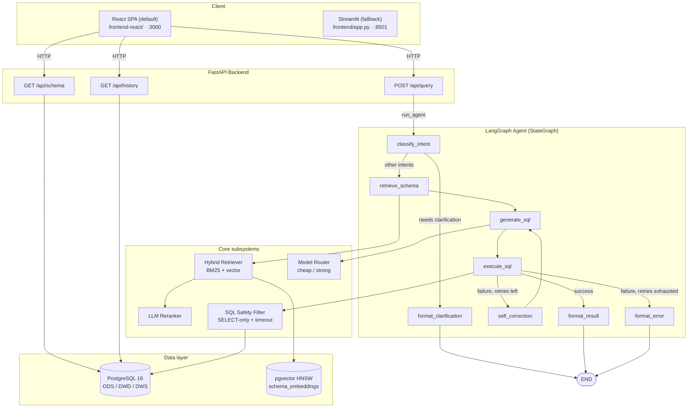

<div align="center">


# Elytra

**LLM-powered intelligent data analysis — natural language in, SQL + visualization out**

[](https://github.com/shuheng-mo/Elytra/actions/workflows/ci.yml)
[](LICENSE)
[](https://www.python.org/)
[](https://fastapi.tiangolo.com/)
[](https://github.com/langchain-ai/langgraph)
[](https://github.com/pgvector/pgvector)
[](#testing)
[](CONTRIBUTING.md)

[English](README_EN.md) | [简体中文](README.md)

</div>

---

## Table of Contents

- [Overview](#overview)
- [Key Features](#key-features)
- [Architecture](#architecture)
- [Supported Data Sources](#supported-data-sources)
- [Tech Stack](#tech-stack)
- [Getting Started](#getting-started)
- [Project Structure](#project-structure)
- [Configuration](#configuration)
- [API Reference](#api-reference)
- [Evaluation](#evaluation)
- [Testing](#testing)
- [Roadmap](#roadmap)
- [Contributing](#contributing)
- [License](#license)

---

## Overview

Elytra is an **NL→SQL intelligent analytics system** for business analysts.
You ask in plain language; the system:

1. **Classifies intent** — simple query, aggregation, multi-join, exploration, or clarification
2. **Retrieves schema** — BM25 + dense vector hybrid retrieval over a YAML data dictionary, then an LLM reranker
3. **Generates SQL** — intent-specific few-shot prompt, routed to a cheap or strong model
4. **Executes safely** — SELECT-only filter, `statement_timeout`, row cap
5. **Self-corrects** — feeds the failed SQL + error back to the LLM, up to 3 retries
6. **Formats results** — picks number / bar / line / table visualization from the result shape

> **It is not a thin NL2SQL wrapper.** Elytra ships a full ODS→DWD→DWS data warehouse, schema-aware retrieval, an Agent loop with self-correction, multi-model routing (cost vs. quality trade-off), and a quantitative evaluation harness.

The reference scenario is an e-commerce SaaS platform: 5 raw operational tables (users, products, orders, payments, behavior logs), 3 cleaned/joined wide tables (order detail, user profile, product dim), and 3 pre-aggregated DWS tables (daily sales, user activity, weekly product ranking).

---

## Key Features

| Capability | Implementation |
|:---|:---|
| **Three-layer warehouse** | ODS (5 tables) → DWD (3 wide / profile / dim) → DWS (3 pre-aggregations) |
| **Hybrid retrieval** | BM25 (custom CJK + Latin tokenizer) + pgvector HNSW cosine search + min-max normalization + weighted fusion (0.4 / 0.6) |
| **Three embedding backends** | OpenAI direct / OpenRouter (`openai/text-embedding-3-large` works) / local `sentence-transformers` (BGE family) |
| **LLM Reranker** | Phase 1 cheap-LLM JSON scoring with graceful upstream-order fallback |
| **LangGraph Agent** | 8-node state machine with intent routing, self-correction loop (up to 3 retries), error fallback |
| **Multi-model routing** | Simple → DeepSeek; multi-table / exploration / repeated failures → Claude Sonnet |
| **SELECT-only safety filter** | Strips comments + string literals before scanning 16 forbidden keywords; rejects multi-statement payloads |
| **OpenRouter-first** | One key routes every model; bare names auto-prefixed; legacy per-vendor keys still supported |
| **Visualization inference** | Dispatch on result shape (rows × cols + column names) → metric / bar / line / table |
| **Quantitative evaluation** | 14-case test set with PASS/FAIL annotations, per-category breakdown, self-correction success rate |

---

## Architecture

End-to-end call chain: React SPA (Streamlit fallback) → FastAPI → LangGraph
agent (10 nodes) → retrieval / routing / execution / chart subsystems →
PostgreSQL + pgvector.



---

## Supported Data Sources

Elytra ships a pluggable **DataSource Connector** layer. Adding a new SQL
engine takes ~100 lines of code (one `DataSourceConnector` subclass) plus a
YAML config block — no changes to the agent, retrieval, or API layers.

| Engine | Status | Use case |
|:---|:---|:---|
| **PostgreSQL** | ✅ Built-in | Default e-commerce warehouse with three layers (ODS / DWD / DWS) |
| **DuckDB** | ✅ Built-in | Embedded OLAP — bundled TPC-H generator + Brazilian Olist real-world dataset |
| **StarRocks** | ✅ Optional | High-performance OLAP, MySQL-compatible protocol, separate docker compose |

The connector contract lives in `src/connectors/base.py::DataSourceConnector`.
Each source is described by one YAML block in `config/datasources.yaml`:

```yaml
default_source: ecommerce_pg

datasources:
  - name: ecommerce_pg
    dialect: postgresql
    description: "E-commerce simulated warehouse"
    connection:
      host: ${DB_HOST:-localhost}
      port: ${DB_PORT:-5432}
      database: Elytra
    overlay: db/data_dictionary.yaml         # optional Chinese metadata

  - name: tpch_duckdb
    dialect: duckdb
    description: "TPC-H standard test dataset"
    connection:
      database_path: ./datasets/tpch/tpch.duckdb
    overlay: config/overlays/tpch_duckdb.yaml
```

API requests pick a source via the `source` field (omit it to use
`default_source`):

```bash
curl -X POST localhost:8000/api/query -d '{
  "query": "Top product category by sales last month",
  "source": "tpch_duckdb"
}'
```

`GET /api/datasources` lists every configured source with its connection
state and table count.

### Quick start: TPC-H

```bash
python datasets/tpch/load_tpch.py                    # SF=0.1 DuckDB (no download)
python -m src.retrieval.bootstrap --source tpch_duckdb
# then ask with source=tpch_duckdb
```

### Quick start: Brazilian E-Commerce

```bash
# 1) Download from https://www.kaggle.com/datasets/olistbr/brazilian-ecommerce
#    Unzip into datasets/brazilian_ecommerce/csv/
python datasets/brazilian_ecommerce/load_brazilian.py
python -m src.retrieval.bootstrap --source brazilian_ecommerce
```

### Enable StarRocks (optional)

```bash
docker compose -f docker/starrocks/docker-compose.starrocks.yml up -d
# See docker/starrocks/README.md for the BE registration step
```

---

## Tech Stack

| Layer | Technology |
|:---|:---|
| Language | Python ≥ 3.11 |
| Database | PostgreSQL 16 + [pgvector](https://github.com/pgvector/pgvector) / DuckDB / StarRocks (optional) |
| LLM framework | [LangChain](https://github.com/langchain-ai/langchain) + [LangGraph](https://github.com/langchain-ai/langgraph) |
| Backend | [FastAPI](https://fastapi.tiangolo.com/) + [Uvicorn](https://www.uvicorn.org/) + [Pydantic v2](https://docs.pydantic.dev/latest/) |
| Frontend (default) | [React 18](https://react.dev/) + [Vite](https://vitejs.dev/) + [Tailwind CSS](https://tailwindcss.com/) + [shadcn/ui](https://ui.shadcn.com/) + [echarts-for-react](https://github.com/hustcc/echarts-for-react) |
| Frontend (fallback) | [Streamlit](https://streamlit.io/) ≥ 1.35 (docker compose `--profile fallback`) |
| BM25 | [rank-bm25](https://github.com/dorianbrown/rank_bm25) |
| Embeddings | OpenAI / OpenRouter / [sentence-transformers](https://www.sbert.net/) |
| DB drivers | psycopg2-binary / asyncpg / duckdb / aiomysql |
| Containers | Docker + Docker Compose |
| Package manager | [uv](https://github.com/astral-sh/uv) (recommended) |
| Testing | pytest + httpx TestClient |

---

## Getting Started

### Prerequisites

- Python ≥ 3.11
- Docker + Docker Compose (recommended)
- One LLM API key — [OpenRouter](https://openrouter.ai/) recommended (one key for every model)

### Option 1: Docker Compose (recommended)

```bash
# 1. Clone
git clone https://github.com/shuheng-mo/Elytra.git
cd Elytra

# 2. Configure
cp .env.example .env
# Edit .env and fill in OPENROUTER_API_KEY

# 3. Bring up the stack (first run pulls pgvector/pg16 + builds backend & frontend)
docker compose up --build -d

# 4. Once db is healthy, populate schema_embeddings (one-shot)
docker compose exec backend python -m src.retrieval.bootstrap

# 5. Run the eval suite end-to-end
docker compose exec backend python eval/run_eval.py
```

Service URLs:

- **Frontend UI (React, default)**: <http://localhost:3000>
- **API Swagger**: <http://localhost:8000/docs>
- **Healthcheck**: <http://localhost:8000/healthz>

> **Streamlit fallback** is reserved for backend cross-checking and chart
> rendering parity. Run `docker compose --profile fallback up` to bring up
> both React (`:3000`) and Streamlit (`:8501`) at the same time. The
> default `docker compose up` only ships React.

### Option 2: Local development

```bash
# 1. Install deps (uv recommended). --extra local-embed pulls
#    sentence-transformers + torch (~700MB on arm64), used by the
#    default local BGE embedding backend.
uv sync --extra local-embed

# 2. Run a pgvector database (compose works too)
docker run -d --name elytra-db \
  -e POSTGRES_DB=Elytra -e POSTGRES_USER=Elytra -e POSTGRES_PASSWORD=Elytra_dev \
  -p 5432:5432 \
  -v "$PWD/db/init.sql:/docker-entrypoint-initdb.d/01-init.sql:ro" \
  -v "$PWD/db/seed_data.sql:/docker-entrypoint-initdb.d/02-seed.sql:ro" \
  pgvector/pgvector:pg16

# 3. Configure .env (point DATABASE_URL at @localhost:5432)
cp .env.example .env

# 4. Bootstrap schema_embeddings
.venv/bin/python -m src.retrieval.bootstrap

# 5. Start the backend
.venv/bin/uvicorn src.main:app --reload --port 8000

# 6. Start a frontend in another terminal — pick one:

# 6a. React frontend (default)
cd frontend-react && npm install && npm run dev
# → http://localhost:5173 (Vite dev server, auto-proxies /api and /ws to 8000)

# 6b. Streamlit fallback (for backend cross-checking)
.venv/bin/streamlit run frontend/app.py
# → http://localhost:8501
```

### Try it

Open <http://localhost:5173> (React, local dev) or <http://localhost:3000>
(React, Docker) or <http://localhost:8501> (Streamlit fallback). Browse the
schema explorer, then try one of the example questions:

- How many registered users do we have in total?
- Which product category had the highest sales last month?
- Daily order count trend over the last 7 days?
- What brand do gold-tier users buy most?
- Which city has the highest average order value?

---

## Project Structure

```text
Elytra/
├── docker-compose.yml     # db + backend + frontend-react (default); --profile fallback adds Streamlit
├── Dockerfile             # backend image
├── pyproject.toml         # uv / pip deps + ruff config
├── .env.example           # API key + model + retrieval template
│
├── frontend-react/        # React SPA default frontend (Vite + Tailwind + shadcn + ECharts)
├── frontend/              # Streamlit fallback (backend cross-checking)
│
├── config/                # datasources.yaml (multi-source registry) + permissions.yaml + overlays/ (schema enrichment)
├── db/                    # init.sql + seed_data.sql + migrations/ + data_dictionary.yaml
├── datasets/              # TPC-H + Brazilian E-Commerce loaders
├── docker/                # optional StarRocks docker compose
│
├── src/
│   ├── config.py          # global config (env vars)
│   ├── main.py            # FastAPI entrypoint with connector lifespan
│   ├── models/            # Pydantic request/response + AgentState + Task models
│   ├── connectors/        # pluggable data source layer (PG / DuckDB / StarRocks) + factory / registry / overlay
│   ├── db/                # psycopg2 infrastructure connection (metadata DB only)
│   ├── retrieval/         # BM25 + pgvector hybrid retrieval + reranker + embedder + multi-source bootstrap
│   ├── auth/              # YAML-driven role-based permission filter
│   ├── tasks/             # in-memory async task manager (Semaphore-bounded)
│   ├── chart/             # result shape → ECharts chart inference
│   ├── observability/     # error classification + input sanitizer (5 rules)
│   ├── evolution/         # experience_pool + query_feedback read/write (self-evolution)
│   ├── agent/             # LangGraph state machine (13 nodes) + nodes/ + prompts/ + llm / cost
│   ├── router/            # cheap / strong model routing
│   └── api/               # REST + WebSocket routes (query / replay / audit / feedback / evolution / ws ...)
│
├── eval/                  # test set + eval runner + report output
├── tests/                 # unit tests (207 passing in ~8s)
├── assets/                # project logo
└── README.md
```

---

## Configuration

All configuration is read from environment variables (`.env` is auto-loaded).
See [`.env.example`](.env.example) for the full list.

### LLM provider

Cloud and local backends can be configured simultaneously. Routing priority: **model-name prefix `ollama/*` or `vllm/*` (if the corresponding base URL is set) > OpenRouter > per-vendor fallback**.

| Variable | Notes |
|:---|:---|
| `OPENROUTER_API_KEY` | **Recommended (cloud default).** One key for every chat model; names must be `vendor/model` |
| `OPENAI_API_KEY` / `DEEPSEEK_API_KEY` / `ANTHROPIC_API_KEY` | Legacy per-vendor keys, only used if `OPENROUTER_API_KEY` is empty |
| `OLLAMA_BASE_URL` | Local [Ollama](https://ollama.com) (≥ 0.2) endpoint, e.g. `http://localhost:11434`. Activates when a model name starts with `ollama/*` |
| `VLLM_BASE_URL` | Self-hosted [vLLM](https://github.com/vllm-project/vllm) OpenAI-compatible server URL, e.g. `http://localhost:8000`. Activates when a model name starts with `vllm/*` |

**Local / self-hosted backend examples**:

```bash
# Ollama — pull the models first
ollama pull qwen2.5:7b
ollama pull nomic-embed-text
# then in .env
OLLAMA_BASE_URL=http://localhost:11434
DEFAULT_CHEAP_MODEL=ollama/qwen2.5:7b
EMBEDDING_MODEL=ollama/nomic-embed-text

# vLLM — launch an OpenAI-compatible server
python -m vllm.entrypoints.openai.api_server --model meta-llama/Llama-3.1-70B-Instruct
# then in .env
VLLM_BASE_URL=http://localhost:8000
DEFAULT_STRONG_MODEL=vllm/meta-llama/Llama-3.1-70B-Instruct
```

### Models

| Variable | Default | Purpose |
|:---|:---|:---|
| `DEFAULT_CHEAP_MODEL` | `deepseek/deepseek-chat` | Simple queries / straightforward aggregation |
| `DEFAULT_STRONG_MODEL` | `anthropic/claude-sonnet-4` | Multi-join / exploration / retry escalation |

### Embeddings (five backends, auto-selected)

| Variable | Behavior |
|:---|:---|
| `EMBEDDING_MODEL=openai/text-embedding-3-large` | Routes through OpenRouter (or direct OpenAI if only that key is set) |
| `EMBEDDING_MODEL=text-embedding-3-small` | Direct OpenAI |
| `EMBEDDING_MODEL=BAAI/bge-small-zh-v1.5` | Local sentence-transformers (`pip install -e ".[local-embed]"`) |
| `EMBEDDING_MODEL=ollama/nomic-embed-text` | Ollama local, 768-dim. Requires `OLLAMA_BASE_URL` + `ollama pull nomic-embed-text`. Fully offline |
| `EMBEDDING_MODEL=vllm/<model_id>` | Self-hosted vLLM. Requires `VLLM_BASE_URL` pointing at a vLLM instance launched with `--model <model_id>` |
| `EMBEDDING_PROVIDER` | `auto` (default) / `openai` / `openrouter` / `local` / `ollama` / `vllm` |
| `EMBEDDING_DIM` | `0` = auto-detect from a known-model lookup table |

> **Switching embedding models requires re-running the bootstrap.** pgvector
> columns are dim-typed, so going from 1536 → 3072 needs a DROP + CREATE.
> Just run `python -m src.retrieval.bootstrap`.

### Retrieval / self-correction

| Variable | Default | Notes |
|:---|:---|:---|
| `BM25_WEIGHT` | `0.4` | Hybrid BM25 weight |
| `VECTOR_WEIGHT` | `0.6` | Hybrid vector weight |
| `RERANK_TOP_K` | `5` | Number of tables returned by the reranker |
| `MAX_RETRY_COUNT` | `3` | Self-correction retry budget |
| `SQL_TIMEOUT_SECONDS` | `30` | Per-statement `statement_timeout` |

### Data sources

| Variable | Default | Notes |
|:---|:---|:---|
| `DEFAULT_SOURCE` | _(unset → reads from YAML)_ | Override for the YAML's `default_source`; the value must match a `name:` in `config/datasources.yaml` |

`config/datasources.yaml` itself supports `${VAR:-default}` placeholders for
host/port/credentials, so per-environment overrides go in `.env`:

| Variable | Used by | Default |
|:---|:---|:---|
| `DB_HOST` / `DB_PORT` / `DB_NAME` / `DB_USER` / `DB_PASSWORD` | `ecommerce_pg` connection block | `localhost` / `5432` / `Elytra` / `Elytra` / `Elytra_dev` |
| `STARROCKS_HOST` / `STARROCKS_PORT` / `STARROCKS_DB` / `STARROCKS_USER` / `STARROCKS_PASSWORD` | `ecommerce_starrocks` connection block | `localhost` / `9030` / `elytra` / `root` / `(empty)` |

---

## API Reference

### `POST /api/query`

Sync entry point. Request body:

```json
{
  "query": "Which product category had the highest sales last month?",
  "session_id": "optional-session-id",
  "source": "ecommerce_pg",
  "user_id": "demo_analyst"
}
```

`source` is optional and falls back to `default_source` from
`config/datasources.yaml`. `user_id` is optional and falls back to
`default_role` from `config/permissions.yaml`. The dialect is automatically
derived from the connector behind the source — the legacy `dialect` field
is still accepted but ignored.

Response:

```json
{
  "success": true,
  "query": "Which product category had the highest sales last month?",
  "source": "ecommerce_pg",
  "dialect": "postgresql",
  "intent": "aggregation",
  "generated_sql": "SELECT category_l1, SUM(total_amount) AS total_sales FROM dwd_order_detail ...",
  "result": [
    {"category_l1": "电子产品", "total_sales": 1523400.00}
  ],
  "visualization_hint": "bar_chart",
  "final_answer": "Query succeeded; returned 1 row.",
  "model_used": "deepseek/deepseek-chat",
  "retry_count": 0,
  "latency_ms": 1240,
  "token_count": 856,
  "error": null,
  "user_role": "analyst",
  "tables_filtered": 0,
  "chart_spec": { "chart_type": "bar", "...": "..." }
}
```

### `POST /api/query/async`

Same request body as `/api/query`. Submits the agent run as a background
task and returns immediately:

```json
{
  "task_id": "a3f7b2c1",
  "status": "pending",
  "ws_url": "ws://localhost:8000/ws/task/a3f7b2c1"
}
```

### `GET /api/task/{task_id}`

Polling fallback for async tasks (use the WebSocket when available):

```json
{
  "task_id": "a3f7b2c1",
  "status": "running",
  "current_step": "generating_sql",
  "progress_pct": 60
}
```

### `WebSocket /ws/task/{task_id}`

After `connect`, the server pushes a JSON event stream:
`{"type": "progress", "step": "generating_sql", "pct": 60}` after each
LangGraph node finishes, then `{"type": "complete", "status": "success"}`
when the run finalizes. The React frontend uses this stream to drive the
real-time agent timeline.

### `POST /api/replay/{history_id}`

Re-executes a historical query through the full pipeline and compares the
result hash with the original. Returns `result_match: bool` plus a
`diff_summary` when hashes differ — useful for verifying that a model
upgrade still produces identical answers.

### `GET /api/audit/stats?days=7`

Returns aggregate statistics over the last `N` days: total queries, success
rate, average latency, total cost (USD), and breakdowns by model / intent /
source / user. The `total_cost_usd` and per-model cost are populated from
`query_history.estimated_cost`, computed by `src/agent/cost.py` at write
time.

### `GET /api/datasources`

Lists every connector registered with `ConnectorRegistry`:

```json
{
  "datasources": [
    {
      "name": "ecommerce_pg",
      "dialect": "postgresql",
      "description": "E-commerce simulated warehouse (ODS / DWD / DWS)",
      "connected": true,
      "table_count": 13,
      "is_default": true,
      "user_managed": false
    },
    {
      "name": "tpch_duckdb",
      "dialect": "duckdb",
      "description": "TPC-H standard test dataset",
      "connected": true,
      "table_count": 8,
      "is_default": false,
      "user_managed": false
    }
  ],
  "default": "ecommerce_pg"
}
```

`connected: false` means the connector failed its startup ping — the rest
of the registry still comes up so other sources stay queryable.
`user_managed: true` marks entries that were added at runtime via
`POST /api/datasources` and persisted to `config/datasources.local.yaml`.

### `GET /api/datasources/types`

Returns the per-dialect form-field schema (required / optional fields with
type and description) used by the React Data Connectors page to render its
dynamic "add data source" form.

### `POST /api/datasources`

Hot-adds a new connector at runtime. The handler validates the request,
dispatches via `ConnectorFactory`, performs a live ping, registers the
connector, pre-warms its schema cache, and persists it to
`config/datasources.local.yaml` (file mode `0600`, gitignored). The
git-tracked `config/datasources.yaml` is never modified.

### `DELETE /api/datasources/{name}`

Removes a connector from the in-memory registry. User-managed entries are
also stripped from `datasources.local.yaml`. Primary entries are removed
runtime-only — the next backend restart re-loads them from
`config/datasources.yaml`. Returns `204 No Content`.

### `GET /api/schema?source=<name>`

Returns the schema for one data source, grouped by warehouse layer (`ODS` /
`DWD` / `DWS`, plus `OTHER` for sources without layer prefixes). Pass
`?source=` to pick a specific source; omit it for the default. The SYSTEM
layer is always hidden.

### `GET /api/history?session_id=xxx&limit=20`

Past query runs filtered by `session_id`, ordered by `created_at desc`.
`limit ∈ [1, 200]`. Each row carries the audit columns added in v0.3.0:
`user_id`, `user_role`, `source_name`, `result_row_count`, `result_hash`,
plus `estimated_cost` (added in v0.4.0).

Full OpenAPI schema at <http://localhost:8000/docs>.

---

## Evaluation

The test set lives in [`eval/test_queries.yaml`](eval/test_queries.yaml) (17 cases across 5 categories + cross-source validation). Run:

```bash
python eval/run_eval.py
# Or pass parameters
python eval/run_eval.py --api-url http://localhost:8000 --filter aggregation
```

Reports land in `eval/results/<timestamp>.{json,md}`. The markdown report
annotates each metric with PASS/FAIL, breaks down by category, and includes
per-case detail.

### Verification (2026-04-06)

| Metric | Value | Target | Status |
|:---|---:|---:|:---:|
| SQL execution success rate | 92.9 % | ≥ 85 % | ✅ PASS |
| Result accuracy rate | 92.9 % | ≥ 75 % | ✅ PASS |
| Schema recall rate | 92.9 % | ≥ 80 % | ✅ PASS |
| Avg latency | 204 ms | < 5 000 ms | ✅ PASS |
| Self-correction rate | 50 % (2 retried) | informational | — |

---

## Testing

```bash
# Whole suite
.venv/bin/python -m pytest tests/

# Verbose
.venv/bin/python -m pytest tests/ -v

# One file
.venv/bin/python -m pytest tests/test_agent.py -v
```

Currently **207 / 207 passing** in ~8 s. Coverage:

- `test_connectors.py` (32 cases) — SQL safety filter, `ColumnMeta`/`TableMeta`/`QueryResult` data contracts, `ConnectorFactory` lazy import + dialect routing, `ConnectorRegistry` singleton + `${VAR:-default}` env-var expansion, `enrich_with_overlay` for both YAML structures
- `test_retrieval.py` (20 cases) — tokenizer, BM25, min-max normalization, `HybridRetriever` score fusion, vector-failure fallback, real data dictionary smoke test
- `test_agent.py` (43 cases) — SQL safety filter, model routing (all branches incl. intent-first routing), 10-node behavior with stub-connector injection, full graph end-to-end (success / retry-then-success / retry exhaustion / clarification short-circuit), heuristic intent classifier
- `test_api.py` (16 cases) — `/healthz`, `/api/query` (success / failure / explicit source / unknown source / empty / agent crash 500), `/api/datasources`, `/api/schema?source=`, `/api/history`
- `test_audit.py` (12 cases) — `_compute_result_hash` determinism, `/api/replay/{id}` round-trip, `/api/audit/stats` aggregation
- `test_permissions.py` (17 cases) — role resolution, table / column filtering, `LIMIT` injection and clamping, glob matching
- `test_tasks.py` (10 cases) — `TaskManager` lifecycle, semaphore-bounded concurrency, event subscription, async endpoint
- `test_chart.py` (25 cases) — chart-type inference (six shapes), ECharts spec construction, `chart_generator` node
- `test_sanitizer.py` (32 cases) — jailbreak detection, role reversal, SQL keyword density, length cap, legitimate query passthrough

The tests do not depend on a real database or LLM — every connector is replaced with an in-memory stub injected into the registry, so the whole suite runs in about 8 seconds locally.

---

## Roadmap

Delivered (v0.2.0):

- [x] **Multi-source abstraction layer** — `DataSourceConnector` async ABC; PG / DuckDB / StarRocks engines; YAML-driven config
- [x] **TPC-H + Brazilian E-Commerce datasets** — DuckDB built-in dbgen + Kaggle CSV loader
- [x] **Dialect-aware SQL generation** — `DIALECT_INSTRUCTIONS` switches syntax rules per target engine
- [x] **asyncpg connection pool** — agent hot path is fully async end-to-end

Delivered (v0.3.0):

- [x] **Async task architecture** — `POST /api/query/async` + WebSocket real-time progress + `GET /api/task/{id}` polling fallback
- [x] **Permissions & multi-tenant isolation** — YAML-driven roles (`analyst` / `operator` / `admin`); table glob filter + column blacklist + row cap
- [x] **SQL audit log & replay** — `query_history` extended with 9 audit columns; `POST /api/replay/{id}` result-hash diff; `GET /api/audit/stats` dashboard
- [x] **NL2Chart** — rule-based inference of six chart types (`number_card` / `line` / `bar` / `pie` / `scatter` / `multi_line`) with ECharts JSON output

Delivered (v0.4.0):

- [x] **React SPA default frontend** — Vite + React 18 + Tailwind + shadcn/ui across six pages (Query / Schema Explorer / History / Audit / Data Connectors / Settings); Streamlit retained as a docker compose `--profile fallback` option
- [x] **Real-time agent timeline** — `astream_events(v2)` streamed over WebSocket; each step is click-expandable to show the agent's reasoning log (Claude-style)
- [x] **Runtime connector management** — `POST /api/datasources` add-form + `DELETE`; user-managed entries persist to `config/datasources.local.yaml` (gitignored, `0600`); the primary YAML is never touched at runtime
- [x] **Token cost tracking** — `src/agent/cost.py` blended per-1M-token rates persist into `query_history.estimated_cost`; also fixes a latent bug where async-mode runs were never persisted (`task_manager` now takes a decoupled `persist_fn`)
- [x] **Multi-format export** — Excel + CSV buttons on Schema / History / Audit pages; Settings ships a session-scoped multi-sheet xlsx bundle export

Delivered (v0.5.0):

- [x] **Multi-turn dialogue (full form)** — new LangGraph nodes `resolve_context` and `summarize_conversation`; `query_history.session_id` is the single source of truth; the `conversation_summary` table auto-writes an LLM-compressed recap once the session has ≥ 3 successful turns; the React QueryPage is now a linear ChatGPT-style thread with a "New conversation" button and session indicator
- [x] **Local reranker + column-level retrieval** — `BAAI/bge-reranker-v2-m3` cross-encoder wrapped in a `make_reranker()` factory that picks `auto` / `local` / `llm` from `RERANKER_PROVIDER` (default `llm` to keep latency low; the local model is an explicit opt-in); `schema_embeddings` now indexes both table-level and column-level rows (each source picks up 50–150 extra column rows), and `HybridRetriever` merges column hits back into their parent table with a 0.6 weight; the long-standing `LLMReranker` OpenRouter-bypass bug is fixed in passing
- [x] **Observability (minimal loop)** — new `src/observability/errors.py` with an `ErrorType` enum and `classify_error()` wired into `self_correction`; the new `query_history.error_type` column powers `top_errors` aggregation in the audit dashboard; `src/observability/sanitizer.py` gates `run_agent_async` with five rules (length cap / jailbreak phrases / role reversal / SQL-keyword density / markdown fences)
- [x] **Daily query trend** — `AuditStatsResponse.time_series` aggregates totals + successes per day with Python-side zero-fill so the frontend line chart is contiguous; `AuditDashboard` replaces the placeholder with ECharts `line` and gains three self-evolution KPI cards
- [x] **Agent self-evolution** — `experience_pool` and `query_feedback` pgvector tables with an `embedding` column injected at runtime by `Embedder.bootstrap_experience_tables()` (detects dim mismatch and drops the stale column automatically); `retrieve_experience` / `save_experience` nodes are conditionally activated on the success-after-retry path; `POST /api/feedback` + `GET /api/evolution/stats` + React `FeedbackButtons` close the UI loop; a single `PromptContext` dataclass unifies the injection point for dynamic few-shot examples and conversation context

Delivered (v0.6.0):

- [x] **Performance optimization (5.7x speedup)** — singleton Embedder + `local_files_only` + startup pre-warm eliminate cold-start overhead; heuristic intent classifier replaces LLM call (−10s); LLM rerank disabled by default (−12s); OpenRouter client connection reuse; cross-node query embedding cache; intent-aware dynamic top-K; end-to-end latency reduced from ~57s to ~10s
- [x] **Per-node timing instrumentation** — every LangGraph node reports `elapsed_ms` via `node_timings` in `AgentState` and the API response
- [x] **Admin runtime config** — `GET/PUT /api/config` admin-only endpoint for hot-reloading model names, retrieval weights, retry count, timeouts without restart; React Settings page shows an admin-only editor card; API keys are excluded for security
- [x] **Feedback button fix** — async mode `history_id` now written back to state; frontend `agentStateToResponse` maps `history_id`/`session_id` correctly
- [x] **PermissionBadge fix** — QueryPage role display reads from `useSettings()` instead of hardcoded `'analyst'`

Next-phase highlights (v0.7 → v1.0, positioning Elytra in the **Text-to-Analytics Pipeline** category with a two-moat "verification + modeling" strategy):

**v0.7.0 — Trustworthy SQL** (Verification Loop, the hallucinated-SQL safety net)

- [ ] **SQL AST static validation** — introduce `sqlglot` to parse every generated SQL; validate tables/columns against the `retrieved_schemas` whitelist; reject hallucinated identifiers and suspicious JOIN conditions
- [ ] **EXPLAIN dry-run layer** — add an `explain()` abstract to `DataSourceConnector` implemented by each dialect; pre-intercept queries with anomalous row estimates, empty result sets, or type mismatches before real execution
- [ ] **Result sanity check** — magnitude comparison against historical same-template queries, anomalous group count, NaN/Inf/empty-set detection; flagged results surface via `verification_flagged` without hard-blocking
- [ ] **Multi-path generation + majority voting** — for high-complexity queries, generate 3 candidates concurrently (different temperatures or models) and pick the majority winner after sqlglot normalization
- [ ] **Hard-negative benchmark** — expand the eval set from 17 to 50 cases plus 10 "known-bad SQL" hard-negatives; ship an A/B runner that compares interception rate before vs after verification

**v0.8.0 — Schema Intelligence Lite** (dirty-schema automation)

- [ ] **Column-level profiling cron** — weekly sampling of distinct count / null% / sample values written to a `column_profile` table that feeds into retriever weighting
- [ ] **Automatic FK/PK discovery** — infer cross-table relationships via value-overlap ratio (> 0.9) + naming heuristics (`*_id`) + type compatibility
- [ ] **Schema drift detection** — diff each introspection against the previous snapshot; log additions / deletions / type changes, alert within 24h
- [ ] **Auto-overlay generation** — let the LLM propose column display names and business descriptions into `config/overlays/<source>.auto.yaml`; manual overlay always wins on conflict

**v0.9.0 — Semantic Layer + Public Benchmark** (the data spine of the external narrative)

- [ ] **Metric proposer + review UI** — from `query_history` + profiling, propose business metric definitions ("active user", "GMV", ...); a new `SemanticReviewPage` supports human-in-the-loop approval
- [ ] **Spider 2.0 enterprise subset scoreboard** — run BigQuery + Snowflake verticals (30 cases each); target pass rate ≥ 35%
- [ ] **In-house Chinese enterprise schema benchmark v1** — 100 cases spanning ODS/DWD/DWS layers and multiple dialects; target accuracy ≥ 75%
- [ ] **Public leaderboard page** — track v0.5 → v0.9 trajectory across four benchmarks

**v1.0.0 — Polish & Public Launch** (GA + distribution)

- [ ] **English README + 3-minute Docker Compose quickstart** — lower the GitHub onboarding friction
- [ ] **Technical whitepaper + blog posts + demo videos** — complete narrative for Verification + Schema Intelligence, suitable for a workshop submission
- [ ] **Public GA release** — Show HN / r/dataengineering / a16z newsletter
- [ ] **3 real-world case studies** — co-authored with seed users

**Shipped** (v0.6.x infra patch, no hero-feature time budget consumed):

- [x] **Private LLM deployment (Ollama / vLLM)** — both chat and embedding support `ollama/*` and `vllm/*` model-name prefix routing
- [x] **GitHub Actions CI** — ruff lint + full pytest regression on every push / PR, see `.github/workflows/ci.yml`

**v1.1+ candidate pool** (prioritized post-GA based on community feedback, nothing pre-committed): federated cross-source queries (DuckDB as the in-memory federation layer), dbt package integration, VSCode extension, enterprise IAM (LDAP/SSO/Ranger), Multi-Hop query decomposition, tool-use / function-calling agent, row-level security + data masking, K8s Helm chart

---

## Contributing

PRs welcome! Please read [CONTRIBUTING.md](CONTRIBUTING.md) for the development workflow, code style, and commit conventions.

Bug reports and feature requests go to [GitHub Issues](https://github.com/shuheng-mo/Elytra/issues).

---

## License

[MIT](LICENSE) © shuheng-mo

---

<div align="center">


**[⬆ Back to top](#elytra)**

</div>
